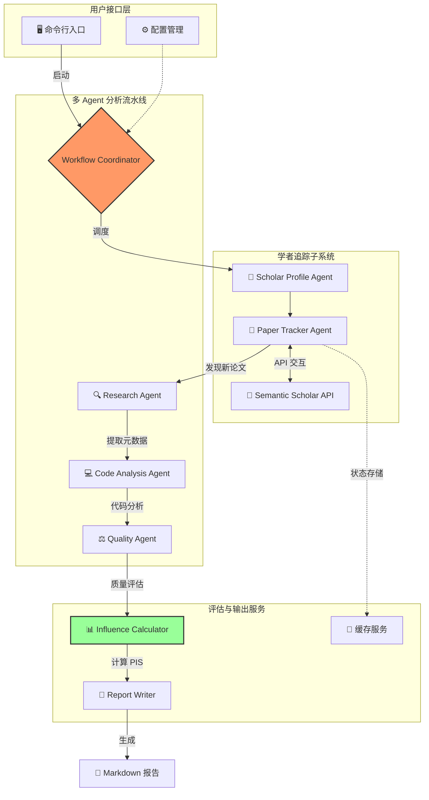

# PaperBot: 顶会论文分析与学者追踪框架

## 📚 概述

PaperBot 是一个专为计算机领域设计的智能论文分析框架。它不仅支持从四大安全顶会（IEEE S&P、NDSS、ACM CCS、USENIX Security）自动获取论文，还新增了**学者追踪系统**，能够自动监测指定学者的最新发表，进行多 Agent 深度分析，并生成包含影响力评分（PIS）的详细报告。

## ✨ 核心功能

### 1. 学者追踪与智能分析 (New!)
- **全自动追踪**: 定期监测指定学者的最新论文（基于 Semantic Scholar）。
- **多 Agent 协作**:
  - **Research Agent**: 提取论文核心贡献与摘要。
  - **Code Analysis Agent**: 自动发现并分析关联 GitHub 仓库，评估代码质量与可复现性。
  - **Quality Agent**: 综合评估论文质量。
- **影响力评分 (PIS)**: 基于学术指标（引用、顶会）与工程指标（代码、Stars）计算 PaperBot Impact Score。
- **自动化报告**: 生成包含关键指标、代码要点及推荐评级的 Markdown 报告。

### 2. 顶会论文获取
- 支持四大顶会论文自动下载：
  - IEEE Symposium on Security and Privacy (IEEE S&P)
  - Network and Distributed System Security Symposium (NDSS)
  - ACM Conference on Computer and Communications Security (ACM CCS)
  - USENIX Security Symposium
- 智能并发下载与元数据提取。

### 3. 代码深度分析
- 自动提取论文中的代码仓库链接。
- 代码质量、结构与安全性分析。

## 🏗️ 系统架构



## 🚀 快速开始

### 1. 环境准备
```bash
# 安装依赖
pip install -r requirements.txt
```

### 2. 学者追踪 (Scholar Tracking)

**配置订阅**:
编辑 `config/scholar_subscriptions.yaml` 添加你想追踪的学者：
```yaml
subscriptions:
  scholars:
    - name: "Dawn Song"
      semantic_scholar_id: "1741101"
  settings:
    check_interval: "weekly"
    min_influence_score: 50
    reporting:
      template: "paper_report.md.j2"
      persist_history: true
```

**运行追踪**:
```bash
# 追踪所有订阅学者，生成报告
python main.py track

# 仅查看追踪状态摘要
python main.py track --summary

# 强制重新检测指定学者（忽略缓存）
python main.py track --scholar-id 1741101 --force

# Dry-run 模式（不生成文件，仅打印结果）
python main.py track --dry-run

# 指定配置文件
python main.py track --config my_subscriptions.yaml
```

### 3. 会议论文下载

```bash
# 下载 CCS 2023 论文 (默认智能并发模式)
python main.py --conference ccs --year 23

# 下载 NDSS 2023 论文
python main.py --conference ndss --year 23
```

## 📂 目录结构

```
PaperBot/
├── main.py                 # 统一入口脚本
├── config/                 # 配置文件
│   ├── scholar_subscriptions.yaml
│   └── settings.py
├── core/                   # 核心工作流
│   └── workflow_coordinator.py
├── scholar_tracking/       # 学者追踪核心
│   ├── agents/             # 追踪相关 Agent
│   ├── services/           # 缓存与订阅服务
│   └── models/             # 数据模型
├── agents/                 # 通用分析 Agent
│   ├── research_agent.py
│   ├── code_analysis_agent.py
│   └── quality_agent.py
├── influence/              # 影响力评分计算
├── reports/                # 报告生成
│   ├── templates/          # Jinja2 模板
│   └── writer.py
├── output/reports/         # 生成的分析报告
└── cache/                  # 数据缓存
```

## 🔄 学者追踪工作流


## 🛠 配置说明

主要配置文件位于 `config/` 目录下：
- `scholar_subscriptions.yaml`: 学者订阅列表及追踪设置。
- `config.yaml`: 全局系统配置。

### 环境变量
- `OPENAI_API_KEY`: 用于 LLM 分析（可选）。
- `GITHUB_TOKEN`: 用于 GitHub API 调用（提高限流阈值）。

## 🙏 致谢

特别感谢 [Qc-TX](https://github.com/Qc-TX) 对爬虫脚本的完善与贡献！


