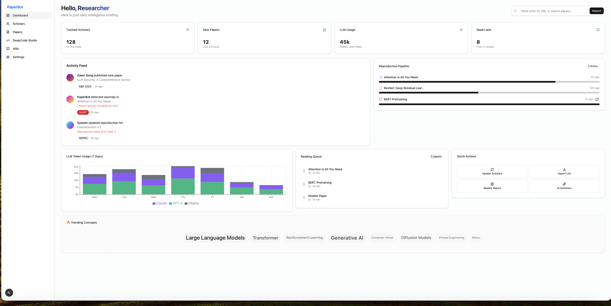
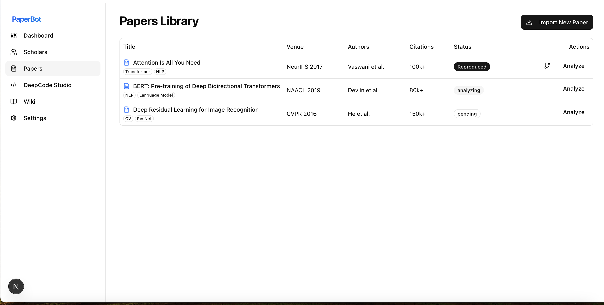
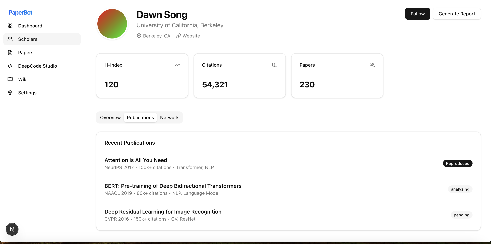
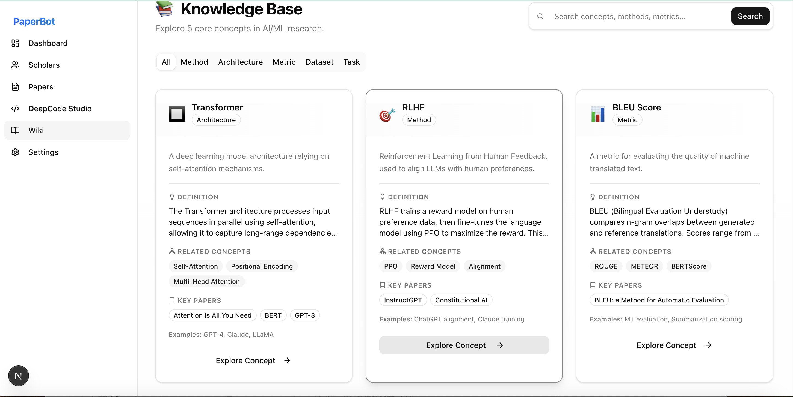
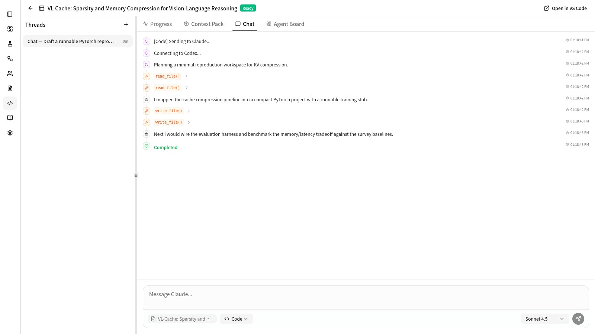

# PaperBot：顶会论文分析与学者追踪框架

PaperBot 是一个面向计算机领域的研究工作流工具链：支持从顶会自动获取论文、持续追踪学者发表、通过多 Agent 完成论文/代码深度分析与评审，并生成包含影响力评分（PIS）的结构化报告；同时提供 Paper2Code（ReproAgent）能力，用于从论文生成代码骨架并进行验证。

此外，本仓库包含一个 **AI for Science & LLM Papers Collection**（`AI4S/`），收录相关顶会论文与代码实现（也可参考 [AI4S Repository](https://github.com/jerry609/AI4S)）。

## 概述

- **后端**：Python（Agents / Workflows）+ FastAPI（SSE 流式）
- **客户端**：Terminal UI（Ink/React）+ Web Dashboard（Next.js）
- **数据源**：Semantic Scholar（可选 API Key）、会议官网/出版方页面、GitHub、（可选）OpenReview、（可选）本地/混合数据源

> 改造的详细评估与可执行计划见：`docs/PLAN.md`

## 核心功能

### 1. 学者追踪与智能分析

- **全自动追踪**：定期监测指定学者的最新论文（基于 Semantic Scholar；支持离线/本地数据源回退）。
- **Deep Research 模式**：支持迭代式反思循环（Reflection Loop），对论文与方向进行多轮检索与总结，构建更完整的学者画像。
- **多 Agent 协作**：
  - **ResearchAgent**：提炼论文贡献点、摘要与方法概括，并支持 Literature Grounding（新颖性/先验工作验证）。
  - **CodeAnalysisAgent**：发现并分析关联 GitHub 仓库，评估工程质量与可复现性。
  - **Quality/Reviewer/Verification**：质量评估、深度评审、声明验证等。
- **影响力评分（PIS）**：
  - **静态指标**：引用数、venue 等级、GitHub Stars 等。
  - **动态指标**：Citation Velocity（引用增速）与 Momentum Score（趋势动量）。
  - **引用语境情感**：可选，基于 LLM 区分正面/负面/中性引用语境（未配置时自动降级）。
- **自动化报告**：生成 Markdown 报告（支持模板渲染与学术模板）。

### 2. 顶会论文获取

- 支持四大安全顶会论文下载与元数据提取：
  - IEEE Symposium on Security and Privacy (IEEE S&P)
  - Network and Distributed System Security Symposium (NDSS)
  - ACM Conference on Computer and Communications Security (ACM CCS)
  - USENIX Security Symposium
- 支持“智能下载”（批量下载 + 动态并发调整 + 缓存命中统计）。

### 3. 代码深度分析

- 自动提取论文/页面/PDF 中的代码仓库链接（优先 GitHub）。
- **深度健康检查**（Code Health）：
  - **空壳检测**：识别仅含 README/占位内容的仓库。
  - **文档覆盖率**：评估 README/API 文档/示例完整性。
  - **依赖风险扫描**：识别高风险/过时依赖（基于工具链与策略配置）。

### 4. 深度评审（ReviewerAgent）

- **DeepReview 模式**：模拟同行评审流程（初筛 → 深度批评 → 决策）。
- 输出结构化评审报告：Summary、Strengths、Weaknesses、Novelty Score 等。
- 支持 Accept/Reject/Borderline 等决策输出。

### 5. 科学声明验证（VerificationAgent）

- 基于“抽取关键声明 → 检索证据 → 支撑/反驳/争议判定”的流程。
- 多视角证据检索：支持 Semantic Scholar API。
- 输出裁定：Strongly Supported / Refuted / Controversial / Unverified。

### 6. 文献背景分析（Literature Grounding）

- 用于验证“新颖性/相关工作覆盖”：自动生成 prior-art 查询，在学术数据库检索并生成对比结论。

### 7. HuggingFace 模型集成（可选）

- **HuggingFaceAgent**：搜索论文关联的 HuggingFace 模型。
- 获取下载量、点赞数、Model Card 元数据等。
- 依赖：`huggingface_hub`（未安装时会提示并降级）。

### 8. OpenReview 审稿意见（可选）

- **OpenReviewAgent**：从 OpenReview 获取审稿评分与意见（适用于 ICLR/NeurIPS/ICML/AAAI 等）。
- 自动计算平均评分、提取决策结果，并用 LLM 总结优缺点。
- 依赖：`openreview-py`（未安装时会提示并降级）。

### 9. Paper2Code 代码生成（ReproAgent）

- **多阶段流水线**：Planning → Analysis → Generation → Verification。
- **自愈调试**：Verification/Debugging 结合错误分类与修复循环（语法/依赖/逻辑）。
- **执行后端**：支持 Docker 与 E2B 云沙箱（可选）。

#### DeepCode 架构增强（v2.0）

借鉴 DeepCode 的设计理念，ReproAgent 引入以下核心能力：

| 模块 | 功能描述 |
|------|----------|
| **Blueprint Distillation** | 将论文压缩为结构化 Blueprint（包含架构类型、模块层次、关键算法等） |
| **Stateful Code Memory** | 跨文件上下文追踪，基于 AST 的符号索引与依赖感知生成顺序 |
| **CodeRAG** | 代码模式检索（关键词匹配为主），内置常见 PyTorch/Transformer 模式 |
| **Multi-Agent Orchestrator** | 多专用 Agent 协同（Planning/Coding/Debugging/Verification） |
| **Self-Healing Debugger** | 错误分类（语法/依赖/逻辑）+ 自动修复循环 |

架构对比：

```text
Legacy Pipeline:
  PaperContext → PlanningNode → AnalysisNode → GenerationNode → VerificationNode

Orchestrator Pipeline:
  PaperContext → BlueprintDistillation → PlanningAgent → CodingAgent ⟷ DebuggingAgent
                                              ↓               ↓
                                        CodeMemory + RAG    VerificationAgent
```

## 界面预览

### Terminal UI（Ink）


### Web Dashboard（Next.js）



更多界面截图（论文分析/学者画像/Wiki/DeepCode Studio 等）：

1. 论文深度分析视图



2. 学者画像与统计指标



3. Wiki 知识库



4. DeepCode Studio（代码复现）



## 与 AlphaXiv / DeepCode 的主要区别（参考）

### vs AlphaXiv

- **定位**：PaperBot 面向“论文 + 代码 + 复现 + 报告”的多 Agent 工作流；AlphaXiv 更偏论文聚合/推荐。
- **工程维度**：PaperBot 会发现/分析代码仓库并输出工程指标与健康度；AlphaXiv 通常聚焦论文元信息/摘要。
- **学者追踪与报告**：PaperBot 支持订阅与持续追踪并生成报告；AlphaXiv 通常不提供完整闭环。

### vs DeepCode

| 特性 | PaperBot | DeepCode |
|------|----------|----------|
| **核心定位** | 学者追踪 + 论文分析 + 代码复现 | Paper2Code 生成 |
| **Agent 架构** | 多 Agent 协作（研究/代码/质量/评审/验证） | 模块化 Agent 流水线 |
| **执行后端** | Docker + E2B（可选） | 多为本地执行 |
| **影响力分析** | PIS、引用速度、（可选）引用情感 | 通常不包含 |
| **学者追踪** | 支持 | 通常不包含 |
| **自愈调试** | 支持 | 支持（实现细节不同） |
| **Blueprint/Memory/RAG** | 已集成 | 已集成 |

## 系统架构


### Coordinator v2（架构升级）

引入协作与快速失败机制，降低低质量任务的资源消耗：

- **ScoreShareBus**：阶段间评分共享与订阅
- **FailFastEvaluator**：早期拦截低质量/无代码/空壳仓库等情况

### Multi-LLM Backend（多后端架构）

支持多种 LLM 后端与成本路由（由 `ModelRouter` 进行任务类型路由）：

- **OpenAI / 兼容接口**：如 `gpt-4o`、`gpt-4o-mini` 等
- **Anthropic**：如 Claude 系列
- **Ollama**：本地模型（可选）

## 快速开始

### 1) 环境准备

- Python >= 3.8（推荐 3.10）
- Node.js >= 18（可选：Terminal UI / Web）
- Docker（可选：复现验证；或使用 E2B）

安装 Python 依赖：

```bash
python -m venv .venv
source .venv/bin/activate
pip install -r requirements.txt
```

可选依赖：

```bash
pip install jinja2
pip install openreview-py huggingface_hub
```

### 2) 配置环境变量

由于仓库忽略规则限制，示例文件使用 `env.example`：

```bash
cp env.example .env
```

至少配置一个 LLM Key（如 `OPENAI_API_KEY`），否则涉及 LLM 的能力将不可用/自动降级。

可选（用于 Research Track Router 的 embedding 路由与缓存；未配置会自动降级为多特征 keyword/memory/task 路由）：

- `OPENAI_API_KEY`
- `OPENAI_BASE_URL`（可选：OpenAI 兼容代理地址）

### 3) 启动 API 服务器（CLI/Web 都依赖它）

```bash
python -m uvicorn src.paperbot.api.main:app --reload --port 8000
```

已实现端点：

| 端点 | 方法 | 描述 |
|------|------|------|
| `/health` | GET | 健康检查 |
| `/api/track` | GET | 学者追踪（SSE） |
| `/api/analyze` | POST | 论文分析（SSE） |
| `/api/gen-code` | POST | Paper2Code（SSE） |
| `/api/review` | POST | 深度评审（SSE） |
| `/api/chat` | POST | AI 对话（SSE） |
| `/api/sandbox/*` | GET/POST | 沙箱/队列/日志/资源指标（DeepCode Studio） |
| `/api/runbook/*` | GET/POST | Runbook 执行与 Workspace 文件操作（DeepCode Studio） |
| `/api/research/*` | GET/POST | 个性化研究：方向（Track）/进度/记忆 Inbox/推荐与反馈 |

#### 个性化研究（Research）关键端点

| 端点 | 方法 | 描述 |
|------|------|------|
| `/api/research/tracks` | GET/POST | 列表/创建研究方向（Track） |
| `/api/research/tracks/active` | GET | 获取当前激活方向 |
| `/api/research/tracks/{track_id}/activate` | POST | 激活方向（切换研究方向） |
| `/api/research/tracks/{track_id}/tasks` | GET/POST | 方向内任务（科研进度） |
| `/api/research/memory/suggest` | POST | 从文本抽取“候选记忆”，写入 Inbox（pending） |
| `/api/research/memory/inbox` | GET | 记忆 Inbox（pending，默认 active track） |
| `/api/research/memory/items/{item_id}/moderate` | POST | 审核/编辑记忆（approve/reject/迁移 scope） |
| `/api/research/memory/bulk_moderate` | POST | 批量审核 Inbox（approve/reject） |
| `/api/research/memory/bulk_move` | POST | 批量迁移记忆到其它方向（防污染） |
| `/api/research/tracks/{track_id}/memory/clear?confirm=true` | POST | 一键清空某方向记忆（软删除，需确认） |
| `/api/research/papers/feedback` | POST | 论文反馈（like/dislike/save…） |
| `/api/research/context` | POST | 构建 ContextPack（含 Track Router 建议与推荐理由） |

### 4) 运行 Terminal UI（Node CLI）

```bash
cd cli
npm install
npm run build
npm start
```

如后端不在默认地址，设置：

- `PAPERBOT_API_URL=http://<host>:8000`

### 5) 运行 Web Dashboard

```bash
cd web
npm install
npm run dev
```

如后端不在默认地址（`http://127.0.0.1:8000`），启动前设置：

- `PAPERBOT_API_BASE_URL=http://<host>:8000`（Next.js 代理到 FastAPI）

#### DeepCode Studio（Web）已实现能力

- Runbook：Paper2Code、Smoke（可选 `docker`/`e2b`）并将日志流写入 Timeline
- Workspace：基于 `outputDir` 的真实文件树（搜索/打开/保存）
- Diff Staging：Baseline 快照、文件级 diff/revert、hunk 级批量回滚

安全说明（默认行为）：

- Workspace/Runbook 文件操作默认仅允许 `tmp` 下的项目目录；如需放开其它根目录，设置 `PAPERBOT_RUNBOOK_ALLOW_DIR_PREFIXES=/path1,/path2`
- Snapshot 默认落盘到 `data/runbook_snapshots`；DB 默认 `sqlite:///data/paperbot.db`

## 常用命令（Python 入口：`main.py`）

### 学者追踪

```bash
python main.py track --summary
python main.py track
python main.py track --scholar-id 1741101
python main.py track --force
```

### 顶会论文下载

```bash
python main.py --conference ccs --year 23
python main.py --conference sp --year 23
python main.py --conference ndss --year 23
python main.py --conference usenix --year 23
```

### 深度评审 / 声明验证

```bash
python main.py review --title "..." --abstract "..."
python main.py verify --title "..." --abstract "..." --num-claims 5
```

### Paper2Code

```bash
python main.py gen-code --title "..." --abstract "..." --output-dir ./output
python main.py gen-code --title "..." --abstract "..." --use-orchestrator --output-dir ./output
```

### 实验与报告渲染（ExperimentRunner）

```bash
python main.py run-exp --config config/experiments/exp_sentiment.yaml
python main.py render-report --template academic_report.md.j2
```

## Roadmap（Plan 摘要）

- **Phase 1（P0）稳定性与一致性**：收敛重复实现、统一网络层与并发模型、补齐解析契约测试
- **Phase 2（P1）数据与运营能力**：DB 持久化、任务队列/调度、指标与告警、成本治理
- **Phase 3（P2/P3）平台化与企业级治理**：Source Registry、插件化、多租户/权限/审计/配额、可观测性与合规

> 详细评估与可执行计划见：`docs/PLAN.md`。

## 文档索引（Docs）

- **总体计划（Plan）**：`docs/PLAN.md`
- **DeepCode 迭代清单（TODO）**：`docs/DEEPCODE_TODO.md`
- **Research 个性化 TODO**：`docs/TODO_PERSONALIZED_MEMORY_CONTEXT.md`
- **数据集说明**：`datasets/README.md`
- **Web Dashboard**：`web/README.md`

## 目录结构（完整）

```text
PaperBot/
│
├── AGENTS.md                              # 贡献者指南（给 agent/协作使用）
├── README.md                              # 项目说明
├── LICENSE
├── env.example                            # 环境变量示例
├── pyproject.toml                         # Python 配置（black/isort/pyright 等）
├── requirements.txt
├── requirements-ci.txt
├── pyrightconfig.json
├── alembic.ini
├── alembic/                               # Alembic 迁移框架（env.py 等）
├── src/                                   # Python 源码（主包在 src/paperbot）
│   └── paperbot/
│       ├── agents/                        # Agents（研究/代码/评审/验证/追踪等）
│       ├── api/                           # FastAPI（SSE）后端
│       │   ├── main.py
│       │   ├── streaming.py
│       │   └── routes/                    # track/analyze/gen_code/review/chat + sandbox/runbook/jobs/runs/memory/research
│       ├── application/                   # 应用层（ports/workflows/registries/collaboration）
│       ├── compat/                        # 兼容层
│       ├── core/                          # 核心抽象（pipeline/errors/di/report_engine 等）
│       ├── domain/                        # 领域模型（paper/scholar/influence 等）
│       ├── infrastructure/                # 基础设施（llm/logging/monitoring/queue/stores/connectors 等）
│       ├── memory/                        # 记忆系统（parsers 等）
│       ├── context_engine/                # Context Engine（Research：路由/上下文包/推荐）
│       ├── presentation/                  # CLI/报告渲染（Python 侧）
│       ├── repro/                         # Paper2Code / Repro（executors/orchestrator/memory/rag/nodes）
│       ├── utils/                         # 工具函数
│       └── workflows/                     # 工作流与节点
├── web/                                   # Web Dashboard（Next.js，DeepCode Studio 在 /studio）
├── cli/                                   # Node.js Terminal UI（Ink/React）
├── docs/                                  # 文档（PLAN + DeepCode TODO）
├── config/                                # 配置（models/venues/subscriptions 等）
├── datasets/                              # 数据集与元数据
├── tests/                                 # Python 测试
├── scripts/                               # 脚本工具
├── evals/                                 # 评测相关
├── output/                                # 生成输出（报告/实验）
├── cache/                                 # 缓存
├── logs/                                  # 运行日志（本地）
├── reports/                               # 生成报告（汇总）
├── papers/                                # 论文缓存/样例
├── public/                                # 静态资源（Web）
├── asset/                                 # 文档/截图资源
├── AI4S/                                  # AI4S 论文与代码集合
├── utils/                                 # 顶层辅助脚本/工具
├── main.py                                # Python 入口
├── validate_datasets.py
└── verify_claude.py
```

## 测试

```bash
pytest -q
```

## 致谢

- 感谢 [Qc-TX](https://github.com/Qc-TX) 对爬虫脚本的贡献
- 多 Agent 协作与深度研究流程部分实践参考了 [BettaFish](https://github.com/666ghj/BettaFish) InsightEngine 的公开实现

## License

MIT，见 `LICENSE`。
