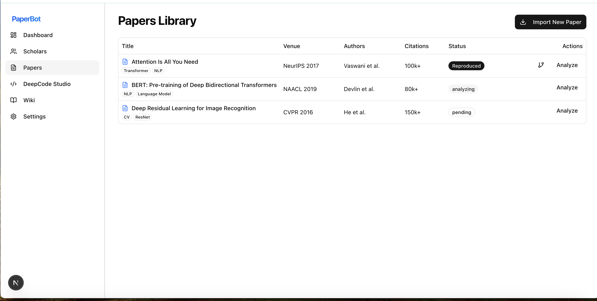
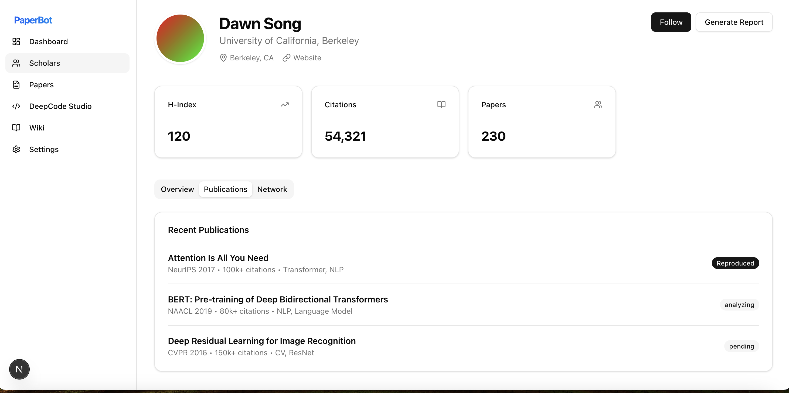
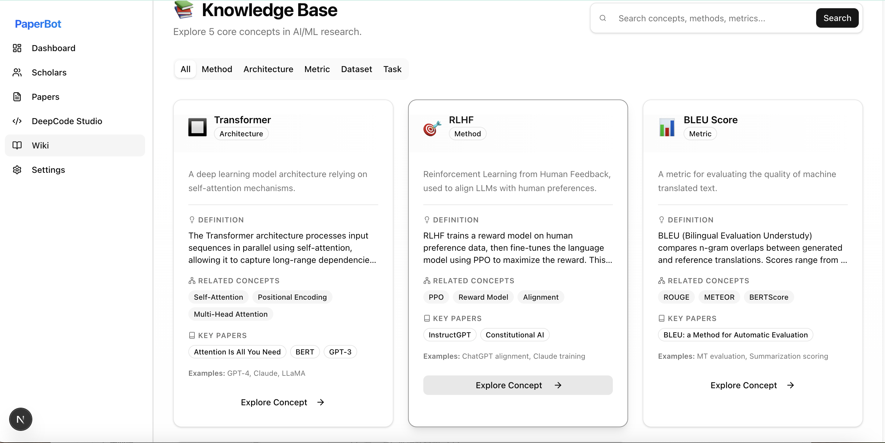
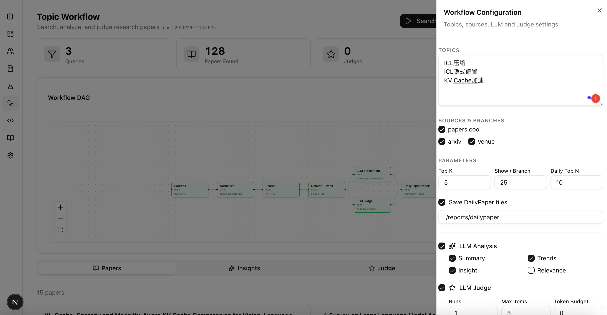
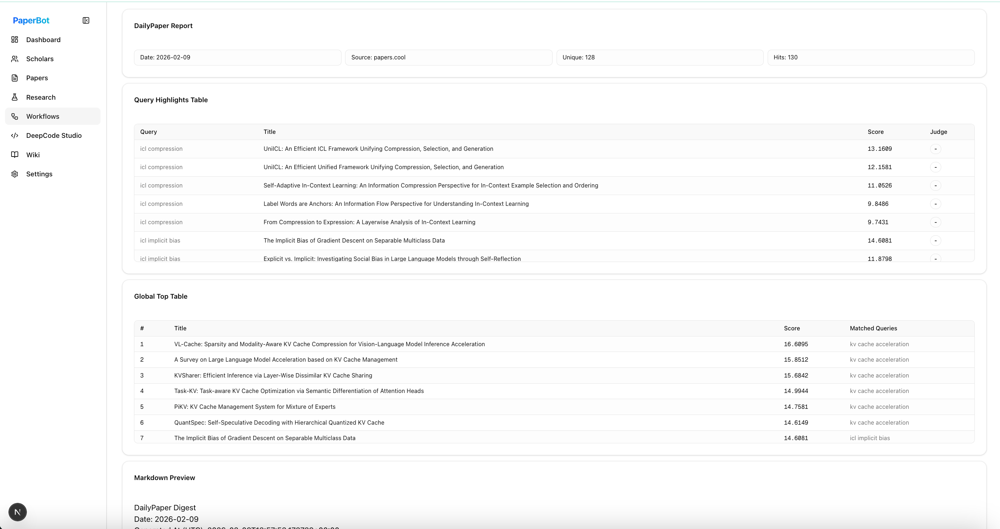
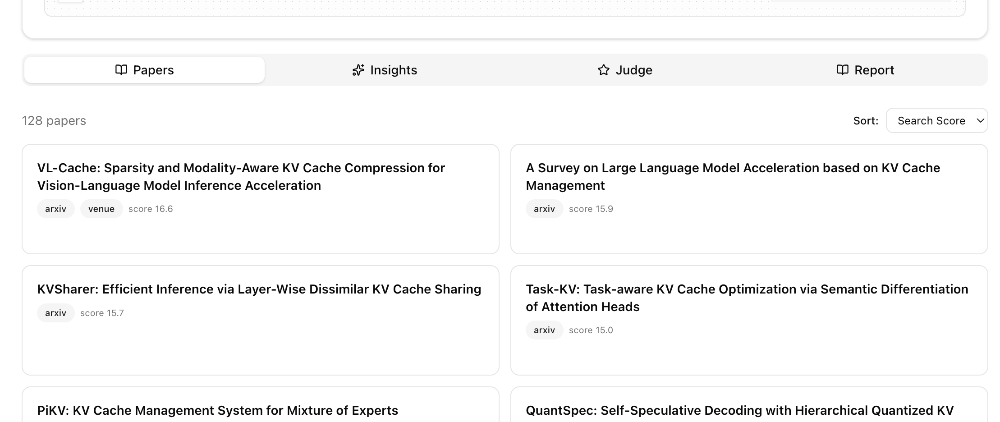

# PaperBot

论文检索、LLM 评审、学者追踪与 Paper2Code/AgentSwarm 的研究工作流工具链。

**后端** Python + FastAPI（SSE 流式） · **前端** Next.js Web + Ink CLI · **数据源** papers.cool / arXiv API / Hugging Face Daily Papers / Semantic Scholar / OpenAlex

## 核心功能

| 模块 | 说明 |
|------|------|
| **Topic Search** | 多主题聚合检索，支持 papers.cool + arXiv API + Hugging Face Daily Papers 三数据源，跨 query/branch 去重与评分排序，`min_score` 质量过滤 |
| **DailyPaper** | 日报生成（Markdown/JSON），SSE 实时流式推送全流程进度，可选 LLM 增强（摘要/趋势/洞察/相关性），Judge 评分后自动过滤低质论文，支持定时推送（Email/Slack/钉钉） |
| **LLM-as-Judge** | 5 维评分（Relevance/Novelty/Rigor/Impact/Clarity）+ 推荐分级（must_read/worth_reading/skim/skip），Token Budget 控制，多轮校准，评分后自动过滤 skip/skim 论文 |
| **Analyze SSE** | Judge + Trend 分析通过 SSE 实时流式推送，前端增量渲染（逐张 Judge 卡片 / 逐条 Trend 分析），完整 Judge 日志保留 |
| **学者追踪** | 定期监测学者论文，多 Agent 协作（Research/Code/Quality/Reviewer），PIS 影响力评分（引用速度、趋势动量） |
| **深度评审** | 模拟同行评审（初筛→深度批评→决策），输出 Summary/Strengths/Weaknesses/Novelty Score |
| **Paper2Code** | 论文到代码骨架（Planning→Analysis→Generation→Verification），自愈调试，Docker/E2B 沙箱执行 |
| **个性化研究** | Research Track 管理、记忆 Inbox（LLM/规则抽取）、Context Engine 路由与推荐 |
| **文献卡片** | Structured Card（LLM 提取 method/dataset/conclusion/limitations），懒加载 + DB 缓存 |
| **导出增强** | BibTeX/RIS/Markdown/CSL-JSON（Zotero 原生导入），Next.js proxy route 修复 |
| **写作辅助** | Related Work 草稿生成（基于 saved papers + topic），[AuthorYear] 引用格式，一键复制 |
| **每日推送** | DailyPaper 生成后自动推送到 Email/Slack/钉钉（支持 API 手动触发 + ARQ Cron 定时）；已集成 MinerU v4 主方法图提取（公网 URL + inline data URL 回退）、LLM Digest + Judge 评分卡片、Apprise 多渠道（Telegram/Discord/企业微信/飞书/RSS） |
| **Model Provider** | 多 LLM 提供商管理（OpenAI/Anthropic/OpenRouter/Ollama），API Key Keychain 安全存储，任务级路由，连接测试 |
| **Deadline Radar** | 会议截止日期追踪，CCF 分级过滤，Research Track 关键词匹配 |
| **论文发现** | 种子论文扩展（引用/被引/共作者），Discovery Graph 可视化，论文集合（Collections）管理 |
| **论文收割** | 批量 arXiv/OpenAlex/Semantic Scholar 收割，元数据补全 + 去重 |
| **AgentSwarm** | 多 Agent 协作平台，统一接入不同 Code Agent（Claude Code/Codex/Cursor/Devin/OpenHands 等），提供任务编排、Runbook 文件管理/Diff/Snapshot、Sandbox 沙箱执行与 Agent 对话；当前已接入 Claude Code |
| **集成导入** | BibTeX 导入 + Zotero 双向同步（Pull/Push） |

## 模块成熟度

| 模块 | 状态 | API | CLI | 说明 |
|------|------|-----|-----|------|
| Topic Search | ✅ 可用 | `/research/paperscool/search` | `topic-search` | 三数据源（papers.cool + arXiv API + HF Daily），评分/去重/min_score 过滤均已落地 |
| DailyPaper | ✅ 可用 | `/research/paperscool/daily` | `daily-paper` | 报告生成 + LLM 增强 + Judge + 保存，完整可用 |
| LLM-as-Judge | ✅ 可用 | `/research/paperscool/analyze` | `--with-judge` | 5 维评分 + 多轮校准 + 推荐分级 + Token Budget，SSE 增量推送 |
| Analyze SSE | ✅ 可用 | `/research/paperscool/analyze` | — | Judge / Trend / Insight 三通道 SSE 流式，前端逐卡片渲染 |
| Push/Notify | ✅ 可用 | `/research/paperscool/daily` | `--notify` | Email/Slack/钉钉 + Apprise 多渠道（Telegram/Discord/企业微信/飞书/RSS）；MinerU v4 主方法图（含 inline 回退）+ LLM Digest/Judge 卡片已落地 |
| 学者追踪 | 🟡 基本可用 | `/track` | `track` | 多 Agent 管线 + PIS 评分完整；依赖 Semantic Scholar API Key |
| 深度评审 | 🟡 基本可用 | `/review` | `review` | 模拟同行评审流程完整；输出质量取决于 LLM 后端配置 |
| Paper2Code | 🟡 基本可用 | `/gen-code`（兼容） + `/research/repro/context/*` | `gen-code` | 编排 + RAG + CodeMemory 完整；执行层计划迁移为 AgentSwarm/Codex 专业执行器 |
| 记忆系统 | 🟡 基本可用 | `/research/memory/*` | — | FTS5 + BM25 文件记忆优先, Embedding 可选增强; OpenClaw 三层架构参考 |
| Context Engine | 🟡 基本可用 | `/research/context` | — | Track Router + Engine 框架 + 本地 DB 搜索回退; 推荐系统采用文件系统 + BM25 优先策略, 无需重型 ML 模型 |
| Model Provider | ✅ 可用 | `/api/model-endpoints/*` | — | 多提供商 CRUD + 连接测试 + 任务路由 + Keychain 安全存储 |
| Deadline Radar | ✅ 可用 | `/research/deadlines/radar` | — | CCF 会议截止日期追踪，Track 关键词匹配 |
| Paper Library | ✅ 可用 | `/api/papers/library` | — | 论文收藏/保存/反馈，Enrichment Pipeline 自动补全元数据 |
| Discovery | 🟡 基本可用 | `/research/discovery/seed` | — | 种子扩展（S2/OpenAlex 引用图）+ Collections CRUD + Graph 可视化 |
| AgentSwarm | 🟡 基本可用 | `/api/runbook/*`, `/api/sandbox/*` | — | 已接入 Claude Code；Codex/Cursor/Devin/OpenHands 待集成 + Runbook 文件管理 + Sandbox 执行 |
| Harvest | 🟡 基本可用 | `/api/harvest/*` | — | arXiv/OpenAlex/S2 批量收割，元数据补全 |
| Import/Sync | 🟡 基本可用 | `/research/integrations/*` | — | BibTeX 导入 + Zotero Pull/Push |

> ✅ 可用 = 核心功能完整、API/CLI 已接通、可直接使用
> 🟡 基本可用 = 实现完整但有外部依赖或配置要求
> 🔴 早期 = 骨架已搭建，核心流程待完善

### 复现执行层迁移说明（2026-03）

- 当前：`/api/gen-code` 仍作为兼容入口，底层是现有 Paper2Code 管线。
- 已具备：`/api/research/repro/context/*` 的 Context Pack 与 Session 入口。
- 下一步：待 AgentSwarm 分支合并后，复现执行将优先路由到 Codex/Swarm 专业执行器，再逐步收敛旧的单体 `gen-code` 路径。

## 架构

> 完整架构图（可编辑）：[Excalidraw](asset/architecture.excalidraw) · [drawio](asset/architecture.drawio)

```
┌─────────────────────────────────────────────────────────────────┐
│  Clients:  Web (Next.js)  ·  CLI (Ink)  ·  ARQ Cron  ·  Push  │
└────────────────────────────┬────────────────────────────────────┘
                             ▼
┌─────────────────── FastAPI Gateway (SSE) ───────────────────────┐
│  /search  /daily  /analyze  /track  /review  /gen-code  /chat  │
│  /model-endpoints  /deadlines  /papers  /research/repro/context │
└────────────────────────────┬────────────────────────────────────┘
                             ▼
┌─ Application (Ports & Services) ──────────────────────────────┐
│  PaperSearchService · EnrichmentPipeline · IdentityResolver    │
│  LLMService · ProviderResolver · PushService                   │
│  TopicSearch · DailyPaper · ScholarPipeline · Paper2Code       │
│  LLM-as-Judge · TrendAnalyzer · Summarizer · ReviewerAgent     │
│  ContextEngine · VerificationAgent                             │
└────────────────────────────┬───────────────────────────────────┘
                             ▼
┌─ Domain ──────────────────────────────────────────────────────┐
│  Paper · Scholar · Track · Feedback · Enrichment · Identity    │
└────────────────────────────┬───────────────────────────────────┘
                             ▼
┌─ Infrastructure (Adapters & Stores) ──────────────────────────┐
│  ModelRouter · KeychainStore · SQLite · Alembic · ARQ          │
│  Adapters: arXiv / S2 / OpenAlex / papers.cool / HF Daily     │
│  Stores: Paper / Research / ModelEndpoint / LLMUsage / Session │
│  Docker / E2B Sandbox                                          │
└────────────────────────────┬───────────────────────────────────┘
                             ▼
┌─ External Sources ─────────────────────────────────────────────┐
│  papers.cool  ·  arXiv API  ·  HF Daily Papers · Semantic Scholar│
│  OpenAlex  ·  GitHub  ·  HuggingFace Hub · OpenReview          │
└────────────────────────────────────────────────────────────────┘
```

### 数据流

```
                   ┌─── papers.cool (arxiv/venue branch)
                   ├─── arXiv API (relevance sort)
Input Queries ──→  ├─── HF Daily Papers
                   ├─── OpenAlex / Semantic Scholar
                   └─── (extensible: PaperSearchPort protocol)
                              │
                    Normalize → Dedup → Score → min_score Filter
                              │
                   ┌── DailyPaper Report (Markdown / JSON)
                   ├── LLM Enrichment (summary / trends / insight)
                   ├── LLM-as-Judge (5-dim scoring, SSE stream)
                   ├── Save to disk / Push to channels
                   └── Web UI (DAG + Tabs: Papers / Insights / Judge)
```

### DailyPaper SSE 流式管线

当启用 LLM 分析或 Judge 评分时，`/daily` 端点返回 SSE 流式响应，前端实时显示每个阶段的进度：

```text
Search → Build Report → LLM Enrichment → Judge Scoring → Filter → Save → Notify → Result
  │          │               │                │            │
  │          │               │                │            └─ 移除 skip/skim 论文
  │          │               │                └─ 逐篇评分，实时推送 judge 事件
  │          │               └─ 逐篇摘要 + 趋势分析 + 洞察
  │          └─ 构建报告结构
  └─ 多源检索 + 去重 + 评分
```

**Post-Judge 过滤**：Judge 评分完成后，自动移除推荐等级为 `skip` 和 `skim` 的论文，只保留 `must_read` 和 `worth_reading` 的论文。完整的 Judge 评分日志保留在 `report.filter.log` 中。

**前端配置持久化**：所有功能开关（LLM/Judge/数据源/邮箱等）默认全部启用，保存在浏览器 localStorage 中，刷新页面不会丢失。

## 界面预览

### Terminal UI（Ink）


### Web Dashboard（Next.js）


| Research Workspace | Model Provider Settings |
|--------------------|------------------------|
|  |  |

| 论文分析 | 学者画像 |
|----------|----------|
|  |  |

| Wiki 知识库 | AgentSwarm |
|-------------|-----------------|
|  |  |

### Topic Workflow

| DAG + 配置面板 | DailyPaper 报告 |
|---------------|----------------|
|  |  |

| 论文卡片 | Insights + Trends |
|---------|-------------------|
|  |  |

| Judge 雷达图详情 |
|-----------------|
|  |

### Email 推送


示例模板包含：导读摘要、Must Read 分层、Judge 评分、Digest Card、主方法图（可公开 URL 或 inline data URL 回退）。

## 快速开始

### 1) 安装

```bash
python -m venv .venv && source .venv/bin/activate
pip install -e .
# 可选
pip install jinja2 openreview-py huggingface_hub
```

### 2) 配置

```bash
cp env.example .env
```

至少配置一个 LLM Key（如 `OPENAI_API_KEY`），否则 LLM 相关功能不可用。也可以在 Web UI `/settings` 页面直接管理 LLM 提供商（API Key 安全存储在 macOS Keychain）。

<details>
<summary>LLM 后端配置（点击展开）</summary>

支持多种 LLM 后端，由 `ModelRouter` 按任务类型自动路由：

| 任务类型 | 路由目标 | 典型模型 |
|---------|---------|---------|
| default / extraction / summary / chat | default | MiniMax M2.1 / gpt-4o-mini |
| analysis / reasoning / review / judge | reasoning | GLM 4.7 / DeepSeek R1 |
| code | code | gpt-4o |

```bash
# OpenAI（默认）
OPENAI_API_KEY=sk-...

# NVIDIA NIM（OpenAI-compatible）
NVIDIA_BASE_URL=https://integrate.api.nvidia.com/v1
NVIDIA_MINIMAX_API_KEY=nvapi-...
NVIDIA_GLM_API_KEY=nvapi-...

# OpenRouter（DeepSeek R1 等 thinking model）
OPENROUTER_API_KEY=sk-or-v1-...

# 显式覆盖（优先级最高）
LLM_DEFAULT_MODEL=...
LLM_REASONING_MODEL=...
```

</details>

<details>
<summary>每日推送配置（点击展开）</summary>

DailyPaper 生成后可自动推送摘要到 Email/Slack/钉钉。有两种配置方式：

**方式一：Web UI 配置（推荐）**

在 Topic Workflow 页面的 Settings 面板中：
1. 勾选 "Email Notification"
2. 填入收件邮箱地址（如 `you@example.com`）
3. 运行 DailyPaper 时会自动在最后发送邮件

> UI 中填写的邮箱会覆盖环境变量中的 `PAPERBOT_NOTIFY_EMAIL_TO`。
> 所有配置项（LLM/Judge/数据源/邮箱等）会自动持久化到浏览器 localStorage，刷新页面不会丢失。

**方式二：环境变量配置**

```bash
# 总开关
PAPERBOT_NOTIFY_ENABLED=true          # 是否启用推送（必须为 true 才能发送）
PAPERBOT_NOTIFY_CHANNELS=email,slack   # 启用的推送渠道（逗号分隔）

# Email (SMTP) — 必须配置才能发送邮件
PAPERBOT_NOTIFY_SMTP_HOST=smtp.qq.com          # SMTP 服务器地址
PAPERBOT_NOTIFY_SMTP_PORT=587                  # SMTP 端口（587=STARTTLS, 465=SSL）
PAPERBOT_NOTIFY_SMTP_USERNAME=your@qq.com      # SMTP 登录用户名
PAPERBOT_NOTIFY_SMTP_PASSWORD=your-auth-code   # SMTP 密码或授权码
PAPERBOT_NOTIFY_SMTP_USE_TLS=true              # 是否使用 STARTTLS（端口 587 时为 true）
PAPERBOT_NOTIFY_SMTP_USE_SSL=false             # 是否使用 SSL（端口 465 时为 true）
PAPERBOT_NOTIFY_EMAIL_FROM=your@qq.com         # 发件人地址
PAPERBOT_NOTIFY_EMAIL_TO=recipient@example.com # 默认收件人（可被 UI 覆盖）

# Slack
PAPERBOT_NOTIFY_SLACK_WEBHOOK_URL=https://hooks.slack.com/...

# 钉钉（支持签名验证）
PAPERBOT_NOTIFY_DINGTALK_WEBHOOK_URL=https://oapi.dingtalk.com/robot/send?access_token=...
PAPERBOT_NOTIFY_DINGTALK_SECRET=SEC...

# DailyPaper 定时任务（ARQ Worker）
PAPERBOT_DAILYPAPER_ENABLED=true
PAPERBOT_DAILYPAPER_CRON_HOUR=8
PAPERBOT_DAILYPAPER_CRON_MINUTE=30
PAPERBOT_DAILYPAPER_NOTIFY_ENABLED=true
PAPERBOT_DAILYPAPER_NOTIFY_CHANNELS=email,slack
```

**QQ 邮箱配置示例：**
1. 登录 QQ 邮箱 → 设置 → 账户 → POP3/SMTP 服务 → 开启
2. 生成授权码（不是 QQ 密码）
3. 设置 `SMTP_HOST=smtp.qq.com`, `SMTP_PORT=587`, `SMTP_USE_TLS=true`

**Gmail 配置示例：**
1. Google 账号 → 安全性 → 两步验证 → 应用专用密码
2. 设置 `SMTP_HOST=smtp.gmail.com`, `SMTP_PORT=587`, `SMTP_USE_TLS=true`

</details>

### 3) 启动

```bash
# DB 迁移（首次）
alembic upgrade head

# API 服务器
python -m uvicorn src.paperbot.api.main:app --reload --port 8000

# Web（另一个终端）
cd web && npm install && npm run dev

# CLI（可选）
cd cli && npm install && npm run build && npm start

# ARQ Worker — 定时任务（可选）
arq paperbot.infrastructure.queue.arq_worker.WorkerSettings
```

后端非默认地址时：
- CLI：`PAPERBOT_API_URL=http://<host>:8000`
- Web：`PAPERBOT_API_BASE_URL=http://<host>:8000`

### 云部署（Vercel + Supabase）

推荐架构：
- 前端：Vercel（`web/`）
- 数据库：Supabase Postgres（`PAPERBOT_DB_URL`）
- API：FastAPI（Render / Railway / Fly.io）

快速入口：`docs/DEPLOY_VERCEL_SUPABASE.md`

体验链接按钮（侧边栏）：
- `NEXT_PUBLIC_DEMO_URL=https://<your-web>.vercel.app`

## API 端点

| 端点 | 方法 | 描述 |
|------|------|------|
| `/health` | GET | 健康检查 |
| `/api/track` | GET | 学者追踪（SSE） |
| `/api/analyze` | POST | 论文分析（SSE） |
| `/api/gen-code` | POST | Paper2Code（SSE，兼容入口） |
| `/api/review` | POST | 深度评审（SSE） |
| `/api/chat` | POST | AI 对话（SSE） |
| `/api/research/paperscool/search` | POST | 主题检索（多源聚合，支持 `min_score` 过滤） |
| `/api/research/paperscool/daily` | POST | DailyPaper 日报（LLM/Judge 启用时返回 SSE 流式，否则 JSON；支持 `notify` 推送） |
| `/api/research/paperscool/analyze` | POST | Judge + Trend 流式分析（SSE） |
| `/api/research/paperscool/approvals` | GET | Pipeline 审批队列 |
| `/api/research/tracks` | GET/POST | 研究方向管理 |
| `/api/research/tracks/:id/feed` | GET | Track 论文 Feed |
| `/api/research/memory/*` | GET/POST | 记忆系统（Inbox/审核/检索） |
| `/api/research/papers/feedback` | POST | 论文反馈（like/dislike/save） |
| `/api/research/papers/saved` | GET | 已保存论文列表 |
| `/api/research/papers/export` | GET | 导出论文（bibtex/ris/markdown/csl_json） |
| `/api/research/papers/{id}/card` | GET | Structured Card（LLM 提取，DB 缓存） |
| `/api/research/papers/related-work` | POST | Related Work 草稿生成 |
| `/api/research/deadlines/radar` | GET | 会议截止日期雷达（CCF 分级 + Track 匹配） |
| `/api/research/context` | POST | ContextPack 构建（含 Track Router） |
| `/api/research/repro/context/generate` | POST | Paper-to-Context 生成（SSE） |
| `/api/research/repro/context/{pack_id}/session` | POST | 从 Context Pack 创建复现 Session（`auto/claude_code/codex/local`） |
| `/api/research/discovery/seed` | POST | 种子论文发现（S2/OpenAlex 引用图扩展） |
| `/api/research/collections` | GET/POST | 论文集合管理 |
| `/api/research/collections/:id/items` | GET/POST/DELETE | 集合内论文 CRUD |
| `/api/research/papers/import/bibtex` | POST | BibTeX 批量导入 |
| `/api/research/integrations/zotero/pull` | POST | Zotero 拉取同步 |
| `/api/research/integrations/zotero/push` | POST | Zotero 推送同步 |
| `/api/model-endpoints` | GET/POST | LLM 提供商列表/创建 |
| `/api/model-endpoints/:id` | PATCH/DELETE | 提供商更新/删除 |
| `/api/model-endpoints/:id/activate` | POST | 设为默认提供商 |
| `/api/model-endpoints/:id/test` | POST | 连接测试 |
| `/api/model-endpoints/usage` | GET | LLM 用量统计（按天/按模型） |
| `/api/papers/library` | GET | 论文库（收藏 + 收割） |
| `/api/sandbox/*` | GET/POST | 沙箱执行与日志 |
| `/api/runbook/*` | GET/POST | Workspace 文件操作与 Diff |
| `/api/harvest/*` | GET/POST | 论文批量收割（arXiv/OpenAlex/S2） |
| `/api/jobs/*` | GET/POST | 后台任务管理（ARQ） |
| `/api/runs/*` | GET | Pipeline 运行记录 |
| `/api/newsletter/*` | GET/POST | Newsletter 生成与管理 |
| `/api/studio-chat` | POST | AgentSwarm 多 Agent 对话（SSE，支持 Claude Code/Codex/Cursor/Devin/OpenHands 路由） |

## CLI 命令

```bash
# 学者追踪
python main.py track --summary
python main.py track --scholar-id 1741101

# 顶会论文下载（IEEE S&P / NDSS / ACM CCS / USENIX Security）
python main.py --conference ccs --year 23

# 深度评审
python main.py review --title "..." --abstract "..."

# 声明验证
python main.py verify --title "..." --abstract "..." --num-claims 5

# Paper2Code
python main.py gen-code --title "..." --abstract "..." --output-dir ./output

# 主题检索
python -m paperbot.presentation.cli.main topic-search \
  -q "ICL压缩" -q "KV Cache加速" \
  --source papers_cool --source arxiv_api --source hf_daily --branch arxiv --branch venue

# DailyPaper（含 LLM + Judge + 推送）
python -m paperbot.presentation.cli.main daily-paper \
  -q "ICL压缩" -q "KV Cache加速" \
  --with-llm --llm-feature summary --llm-feature trends --llm-feature insight \
  --with-judge --judge-runs 2 --judge-max-items 5 \
  --save --notify --notify-channel email
```

## 目录结构

```text
PaperBot/
├── src/paperbot/
│   ├── agents/                        # Agents（研究/代码/评审/验证/追踪）
│   ├── api/                           # FastAPI 后端（SSE 流式）
│   │   ├── routes/                    # 业务路由（track/analyze/paperscool/model_endpoints/...）
│   │   └── streaming.py               # SSE 流式 envelope
│   ├── application/
│   │   ├── ports/                     # 端口接口（PaperSearchPort/EnrichmentPort/FeedbackPort/...）
│   │   ├── services/                  # 应用服务（LLM/PaperSearch/Enrichment/Identity/Provider）
│   │   └── workflows/
│   │       ├── unified_topic_search.py    # 统一主题检索（多源聚合 + min_score）
│   │       ├── dailypaper.py              # 日报生成、LLM 增强、Judge 评分
│   │       └── analysis/                  # Judge / Trend / Summarizer / Relevance
│   ├── core/                          # 核心抽象（pipeline/errors/DI）
│   ├── domain/                        # 领域模型（Paper/Scholar/Track/Feedback/Enrichment/Identity）
│   ├── infrastructure/
│   │   ├── adapters/                  # 搜索适配器（arXiv/S2/OpenAlex/papers.cool/HF Daily）
│   │   ├── connectors/               # 数据源连接器（arXiv/OpenAlex/HF/Reddit/X/Zotero/papers.cool）
│   │   ├── harvesters/               # 批量收割器（arXiv/OpenAlex/S2）
│   │   ├── crawling/                 # HTTP 下载器、请求层、解析器
│   │   ├── llm/                       # ModelRouter（多提供商路由）
│   │   ├── stores/                    # SQLAlchemy 存储（Paper/Research/ModelEndpoint/LLMUsage/Keychain/...）
│   │   └── queue/                     # ARQ Worker（定时任务 + DailyPaper Cron）
│   ├── memory/                        # 记忆中间件（导入/抽取/检索）
│   ├── context_engine/                # Context Engine（Track Router / 推荐）
│   ├── presentation/                  # CLI 入口与 Markdown 报告渲染
│   ├── utils/                         # 工具（secret 加密、文本处理）
│   └── repro/                         # Paper2Code（Blueprint/CodeMemory/RAG/Debugger）
├── web/                               # Next.js Web Dashboard
├── cli/                               # Ink/React Terminal UI
├── alembic/                           # DB 迁移脚本
├── docs/                              # 项目文档
├── config/                            # 配置（models/venues/subscriptions）
├── tests/                             # 测试
├── asset/                             # 截图 + 架构图（drawio / excalidraw）
├── pyproject.toml                     # Python 项目配置
└── env.example                        # 环境变量模板
```

## Roadmap

> 详细评估与可执行计划见 [`docs/PLAN.md`](docs/PLAN.md)
> Epic Issues: [记忆优化 #153](https://github.com/jerry609/PaperBot/issues/153) · [Agentic Research #154](https://github.com/jerry609/PaperBot/issues/154) · [Obsidian CLI #159](https://github.com/jerry609/PaperBot/issues/159) · [每日推送优化 #179](https://github.com/jerry609/PaperBot/issues/179)

### Phase 1 — 稳定性与一致性（P0）

收敛重复实现（下载/抓取统一）、统一网络请求层（退避/限速/熔断）、补齐解析契约测试、日志从 `print` 迁移到结构化 JSON、统一多智能体 `run_id/trace_id` 与消息 envelope。

### Phase 2 — 数据与运营能力（P1）

DB 持久化（统一主数据模型 Paper/Scholar/Event/Run）、任务队列/调度（幂等/重试/死信）、指标与告警（抓取成功率/LLM 失败率/成本）、长期记忆 MVP（Run/Episodic + Semantic Memory）。

### Phase 3 — 记忆与上下文优化（P0-P2）

基于 [OpenClaw](https://github.com/openclaw/openclaw) 三层记忆架构调研，优化 PaperBot 记忆系统：打通推荐→执行上下文桥（ContextEngineBridge）、激活 paper scope 记忆、FTS5 + BM25 无模型语义搜索（可选 sqlite-vec embedding 增强）、CodeMemory 持久化、记忆衰减、Context 分层加载。推荐系统采用**文件系统 + BM25 优先**策略，无需依赖重型 ML 模型。

### Phase 4 — Agentic Research 演进（P0-P2）

将 PaperBot 从论文搜索推荐系统演进为 Agentic Research 平台：BaseAgent 升级为 ReAct 循环 + Tool-Use、ResearchLoopAgent 迭代搜索核心、CitationGraphClient 多跳引用图遍历、SynthesisAgent 跨论文综合、DAGPipeline 替代顺序 Pipeline、Agent Reach 社交媒体采集。参考 [OpenClaw-RL](https://github.com/Gen-Verse/OpenClaw-RL) 的权重级个性化方案探索 RL 驱动的推荐优化。

### Phase 5 — Obsidian CLI 集成

研究成果导出至 Obsidian 知识库：论文笔记自动生成（YAML frontmatter + wiki-links）、Track → 文件夹/MOC 映射、引用关系 → Graph 可视化、研究报告导出、双向同步。

### Phase 6 — 每日推送优化

已完成：
- MinerU v4 官方任务流接入（`/extract/task` + 轮询任务结果），主方法图自动识别。
- 邮件渲染增强：支持主方法图展示（公开 URL）与 `data:image/...` inline 回退（适配 zip 内部图）。
- 推送内容增强：导读摘要 + 一句话总结 + Digest Card + Judge 评分信息。
- Apprise 多渠道统一推送层（Telegram/Discord/企业微信/飞书/RSS）落地。
- HuggingFace Daily Papers API 数据源接入并纳入 DailyPaper 流程。

## 文档索引

| 文档 | 说明 |
|------|------|
| [`docs/ROADMAP_TODO.md`](docs/ROADMAP_TODO.md) | 功能规划与迭代清单（参考 HF/AlphaXiv） |
| [`docs/PLAN.md`](docs/PLAN.md) | 架构评估与重构计划 |
| [`docs/PAPERSCOOL_WORKFLOW.md`](docs/PAPERSCOOL_WORKFLOW.md) | Topic Workflow 端到端流程与配置 |
| [`docs/AGENTSWARM_TODO.md`](docs/AGENTSWARM_TODO.md) | AgentSwarm / Paper2Code 迭代清单 |
| [`docs/memory_system.md`](docs/memory_system.md) | 记忆系统设计文档（跨平台中间件 + 架构提案） |
| [`docs/anchor_system.md`](docs/anchor_system.md) | 锚点作者系统（理论模型 + 实施设计 + TODO） |
| [`docs/TOPIC_SOURCE_TEMPLATE.md`](docs/TOPIC_SOURCE_TEMPLATE.md) | 数据源开发模板 |
| [`docs/p2c/`](docs/p2c/) | Paper2Context 模块设计文档（设计/API/前端/Benchmark/优化） |
| [`docs/AGENTIC_RESEARCH_EVOLUTION.md`](docs/AGENTIC_RESEARCH_EVOLUTION.md) | Agentic Research 演进方案（Gap Analysis + 实施路线图） |
| [`docs/OPENCLAW_RESEARCH_REPORT.md`](docs/OPENCLAW_RESEARCH_REPORT.md) | OpenClaw 源码综述（22 模块深度分析） |
| [`docs/archive/`](docs/archive/) | 归档文档（过期 issue 草案/历史 backlog） |

## 测试

```bash
pytest -q
```

## 致谢

- [Qc-TX](https://github.com/Qc-TX) 对爬虫脚本的贡献
- 多 Agent 协作参考了 [BettaFish](https://github.com/666ghj/BettaFish) InsightEngine 的公开实现
- 记忆系统设计参考了 [OpenClaw](https://github.com/openclaw/openclaw) 三层记忆架构与 [OpenClaw-RL](https://github.com/Gen-Verse/OpenClaw-RL) 个性化方案

## License

MIT
