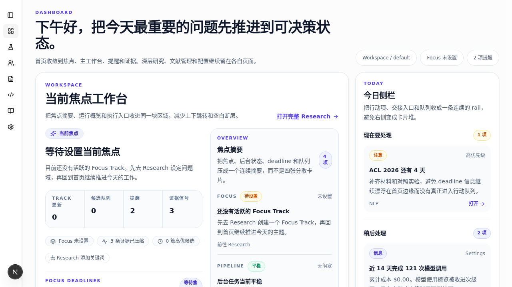
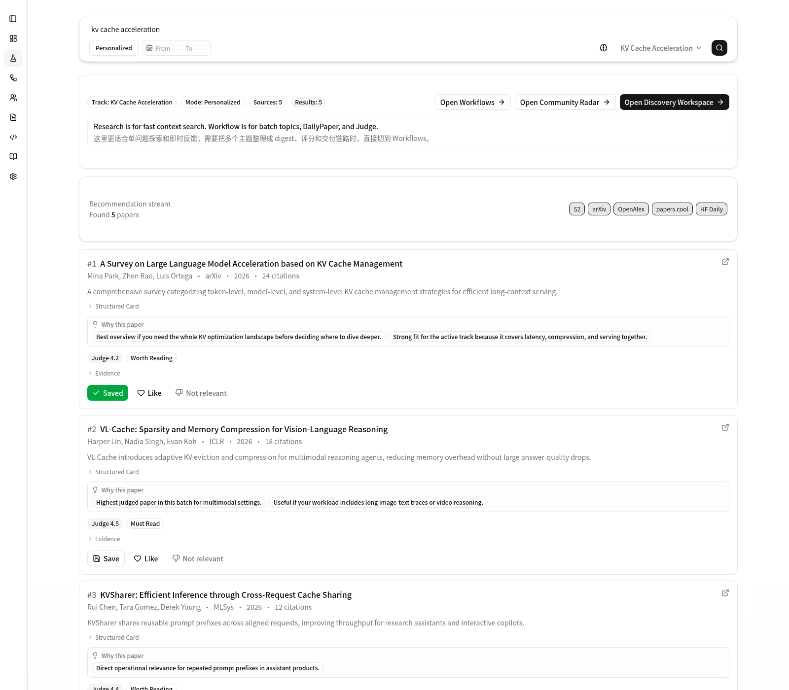
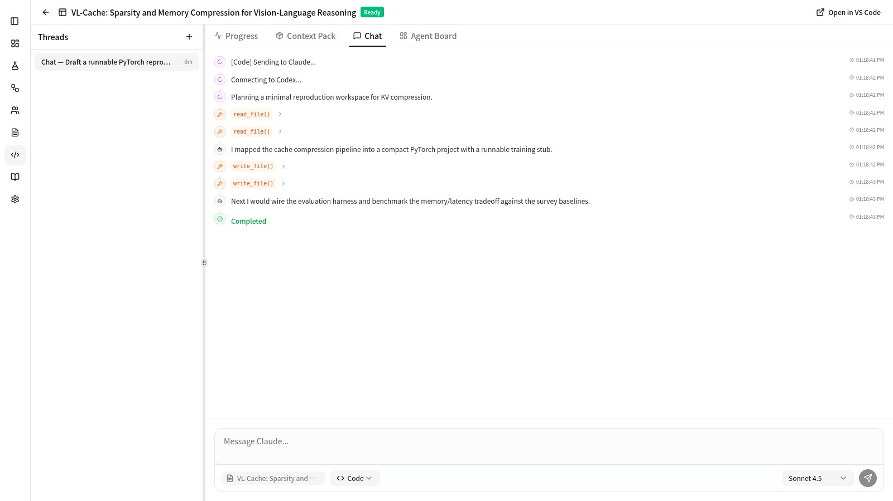
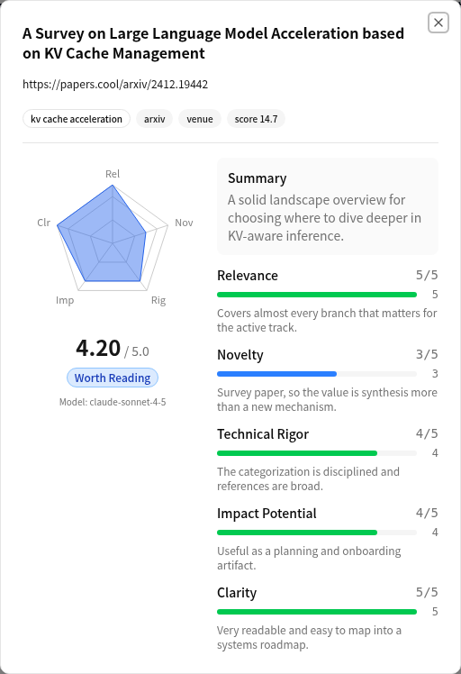
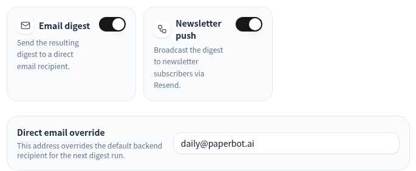
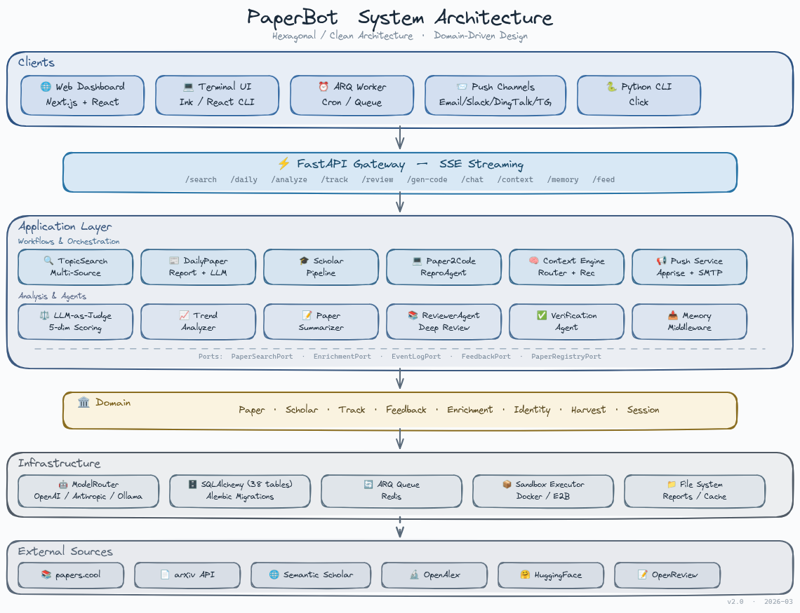

<!-- markdownlint-disable MD001 MD041 -->

<h1 align="center">Oh, God! My idea comes true.</h1>

<h3 align="center">
AI-powered research workflow: paper discovery → LLM analysis → scholar tracking → Paper2Code → multi-agent studio
</h3>

<p align="center">
  <a href="https://github.com/jerry609/PaperBot/actions">
    
  </a>
  <a href="https://github.com/jerry609/PaperBot/issues/232">
    
  </a>
  
  
</p>

<p align="center">
  
  
  
  
</p>

<p align="center">
  <a href="#getting-started"><b>Getting Started</b></a> ·
  <a href="#features"><b>Features</b></a> ·
  <a href="https://github.com/jerry609/PaperBot/issues/232"><b>Roadmap</b></a> ·
  <a href="#architecture"><b>Architecture</b></a> ·
  <a href="#contributing"><b>Contributing</b></a>
</p>

---

## About

"Oh, God! My idea comes true." is an end-to-end research assistant that automates the paper discovery → analysis → reproduction pipeline. It combines multi-source search, LLM-powered evaluation, scholar tracking, and code generation into a unified workflow with Web, CLI, and API interfaces.

**Backend** Python + FastAPI (SSE streaming) · **Frontend** Next.js + Ink CLI · **Sources** arXiv / Semantic Scholar / OpenAlex / HuggingFace Daily Papers / papers.cool

## Screenshots

<details open>
<summary><b>Web Dashboard</b></summary>
<br>



| Research Workspace | AgentSwarm Studio |
|--------------------|-------------------|
|  |  |

| LLM-as-Judge Radar | Email Push |
|---------------------|------------|
|  |  |

</details>

<details>
<summary><b>Terminal UI (Ink)</b></summary>
<br>


</details>

## Features

### Discovery & Analysis

- **Multi-source search** — Aggregate arXiv, Semantic Scholar, OpenAlex, HF Daily Papers, papers.cool with cross-query dedup and scoring
- **DailyPaper** — Automated daily report generation with SSE streaming, LLM enrichment (summary / trends / insight), and multi-channel push (Email / Slack / DingTalk / Telegram / Discord / WeCom / Feishu)
- **LLM-as-Judge** — 5-dimensional scoring (Relevance / Novelty / Rigor / Impact / Clarity) with multi-round calibration, automatic filtering of low-quality papers
- **Deadline Radar** — Conference deadline tracking with CCF ranking and research track matching

### Knowledge Management

- **Paper Library** — Save, organize, and export papers (BibTeX / RIS / Markdown / CSL-JSON / Zotero sync)
- **Structured Cards** — LLM-extracted method / dataset / conclusion / limitations with DB caching
- **Related Work** — Draft generation from saved papers with [AuthorYear] citation format
- **Memory System** — Research memory with FTS5 + BM25 search, context engine for personalized recommendations

### Reproduction & Studio

- **Paper2Code** — Paper → code skeleton (Planning → Analysis → Generation → Verification) with self-healing debugging
- **AgentSwarm** — Multi-agent orchestration platform with Claude Code integration, Runbook file management, Diff/Snapshot, and sandbox execution (Docker / E2B)
- **Scholar Tracking** — Multi-agent monitoring with PIS influence scoring (citation velocity, trend momentum)
- **Deep Review** — Simulated peer review (screening → critique → decision)

## Getting Started

### Install

```bash
# Use python3 for macOS/Linux
python -m venv .venv && source .venv/bin/activate
pip install -e .
```

### Configure

```bash
cp env.example .env
# Set at least one LLM key: OPENAI_API_KEY=sk-...
```

<details>
<summary>LLM routing configuration</summary>

Multiple LLM backends supported via `ModelRouter`:

| Task Type | Route | Example Models |
|-----------|-------|----------------|
| default / extraction / summary | default | gpt-4o-mini / MiniMax M2.1 |
| analysis / reasoning / judge | reasoning | DeepSeek R1 / GLM 4.7 |
| code | code | gpt-4o |

</details>

<details>
<summary>Push notification configuration</summary>

DailyPaper supports Email / Slack / DingTalk / Telegram / Discord / WeCom / Feishu push.

**Web UI** — Configure in the Topic Workflow settings panel (recommended).

**Environment variables:**
```bash
PAPERBOT_NOTIFY_ENABLED=true
PAPERBOT_NOTIFY_CHANNELS=email,slack
PAPERBOT_NOTIFY_SMTP_HOST=smtp.qq.com
PAPERBOT_NOTIFY_SMTP_PORT=587
PAPERBOT_NOTIFY_SMTP_USERNAME=your@qq.com
PAPERBOT_NOTIFY_SMTP_PASSWORD=your-auth-code
PAPERBOT_NOTIFY_EMAIL_FROM=your@qq.com
PAPERBOT_NOTIFY_EMAIL_TO=recipient@example.com
```

</details>

### Run

```bash
# Database migration (first time)
alembic upgrade head

# API server
# Use python3 for macOS/Linux
python -m uvicorn src.paperbot.api.main:app --reload --port 8000

# Web dashboard (separate terminal)
cd web && npm install && npm run dev

# Background jobs (optional)
arq paperbot.infrastructure.queue.arq_worker.WorkerSettings
```

### CLI Usage

```bash
# Daily paper with LLM + Judge + push
python -m paperbot.presentation.cli.main daily-paper \
  -q "LLM reasoning" -q "code generation" \
  --with-llm --with-judge --save --notify

# Topic search
python -m paperbot.presentation.cli.main topic-search \
  -q "ICL compression" --source arxiv_api --source hf_daily

# Scholar tracking
python main.py track --summary

# Paper2Code
python main.py gen-code --title "..." --abstract "..." --output-dir ./output

# Deep review
python main.py review --title "..." --abstract "..."
```

## Architecture

<!-- TODO: 待重绘高清架构图 -->


> Editable source: [Excalidraw](asset/architecture.excalidraw) · [draw.io](asset/architecture.drawio)

## Module Status

> Full maturity matrix and progress: **[Roadmap #232](https://github.com/jerry609/PaperBot/issues/232)**

| Status | Modules |
|--------|---------|
| **Production** | Topic Search · DailyPaper · LLM-as-Judge · Push/Notify · Model Provider · Deadline Radar · Paper Library |
| **Usable** | Scholar Tracking · Deep Review · Paper2Code · Memory · Context Engine · Discovery · AgentSwarm · Harvest · Import/Sync |
| **Planned** | [DB Modernization #231](https://github.com/jerry609/PaperBot/issues/231) · [Obsidian Integration #159](https://github.com/jerry609/PaperBot/issues/159) |

## Roadmap

> **[Roadmap #232](https://github.com/jerry609/PaperBot/issues/232)** — Living roadmap organized by functional area, with checkbox tracking and Epic links.

Active Epics:

| Epic | Area | Status |
|------|------|--------|
| [#197](https://github.com/jerry609/PaperBot/issues/197) | AgentSwarm Studio | Foundation |
| [#231](https://github.com/jerry609/PaperBot/issues/231) | DB Infrastructure | Planning |
| [#153](https://github.com/jerry609/PaperBot/issues/153) | Memory & Context | P0-P1 done |
| [#154](https://github.com/jerry609/PaperBot/issues/154) | Agentic Research | Design done |
| [#179](https://github.com/jerry609/PaperBot/issues/179) | Daily Push | Complete |
| [#159](https://github.com/jerry609/PaperBot/issues/159) | Obsidian CLI | Not started |

## Contributing

1. Pick an unchecked item from the [Roadmap](https://github.com/jerry609/PaperBot/issues/232)
2. Check the linked Epic for detailed requirements
3. Open a PR targeting `dev` branch
4. Follow [Conventional Commits](https://www.conventionalcommits.org/) format

```bash
# Run tests
pytest -q

# Format
python -m black . && python -m isort .
```

## Documentation

| Doc | Description |
|-----|-------------|
| [Roadmap #232](https://github.com/jerry609/PaperBot/issues/232) | Living project roadmap |
| [`docs/PLAN.md`](docs/PLAN.md) | Architecture assessment |
| [`docs/PAPERSCOOL_WORKFLOW.md`](docs/PAPERSCOOL_WORKFLOW.md) | Topic Workflow guide |
| [`docs/p2c/`](docs/p2c/) | Paper2Context design docs |
| [`docs/memory_system.md`](docs/memory_system.md) | Memory system design |
| [`docs/anchor_system.md`](docs/anchor_system.md) | Anchor author system |
| [`docs/AGENTIC_RESEARCH_EVOLUTION.md`](docs/AGENTIC_RESEARCH_EVOLUTION.md) | Agentic Research evolution plan |

## Acknowledgements

- [Qc-TX](https://github.com/Qc-TX) — Crawler contributions
- [BettaFish](https://github.com/666ghj/BettaFish) — Multi-agent collaboration reference
- [OpenClaw](https://github.com/openclaw/openclaw) — Memory architecture reference

## License

MIT
