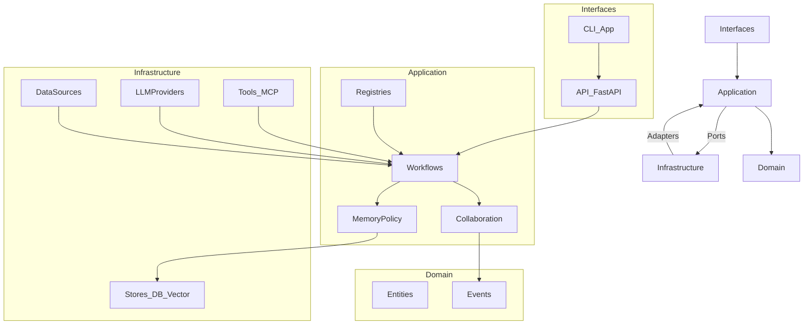

# PaperBot 计划文档（Plan）

本文件承载“爬虫/信息源/信息聚合/企业级化”的**详细评估**与**可执行计划**。根 `README.md` 只保留对外展示所需的摘要与入口链接，以保持风格统一与阅读体验。

## 背景与目标

- **目标**：将 PaperBot 从“研究工作流工具链”逐步演进为“可长期维护、可运营、可扩展”的平台化项目（支持企业级治理能力）。
- **非目标**：短期内直接达到多租户 SaaS、SLA、高可用等完整企业级要求（需分阶段推进）。

## 现状评估（基于当前代码）

### 1) 爬虫/下载（会议抓取与 PDF 下载）

结论：**功能可用，但工程化与可扩展性不足**，主要风险在解析脆弱、网络策略不统一、并发模型不一致。

- **会议抓取覆盖**：`ConferenceResearchAgent` 支持 `ccs/sp/ndss/usenix`，抓取以 HTML 解析为主，受站点改版影响较大。
- **实现分裂**：存在多份 downloader/变体文件并存（维护成本高、行为不一致风险）。
- **并发模型不一致**：外层存在并发控制，但底层下载器可能强制串行，导致“名义并发、实际串行”。
- **反爬/限流策略偏弱**：缺少统一请求层（指数退避、熔断、站点级策略、代理/UA 池等）。
- **可观测性不足**：大量 `print`，缺少结构化日志与指标（错误码分布、成功率、延迟分布、源站健康度）。

### 2) 信息源管理（Source）与信息聚合（Aggregation）

结论：**当前为 MVP 抽象**：有数据源接口雏形与信息流/调度器原型，但缺少统一的“源注册、去重合并、可查询持久化”体系。

- **数据源抽象不足**：`BaseDataSource` 目前主要覆盖本地文件，DB 数据源为占位；`api/hybrid` 多依赖上层回退逻辑。
- **聚合链路偏原型**：信息流与调度器更多是“内存 + 本地 JSON 状态”，缺少统一数据层（DB）带来的可查询、可追溯、可回放能力。
- **去重规则分散**：标题/ID 去重在多处出现，缺少统一的 `PaperIdentity` 归一化策略（DOI/arXiv/S2/GitHub 等）。

### 3) 企业级化差距（架构与治理）

结论：现有架构适合研发迭代与研究使用，但企业化需要补齐平台治理能力。

- **边界与一致性**：重复实现、配置口径分裂（多处读取 env/配置）、模块边界需要收敛。
- **数据层缺失**：缺少统一主数据与运行记录（Run）体系，导致无法审计、回放、统计与运营。
- **任务编排缺失**：缺少作业队列、幂等、死信、回放机制，难以规模化运行。
- **API 治理不足**：缺鉴权/权限/配额/限流/审计日志/TraceID。
- **可观测性不足**：缺 metrics/tracing/logging 规范与落地。
- **安全与合规**：密钥管理、容器执行安全、数据许可追踪需要制度化。

### 4) 多智能体：记忆模块（Memory）与交互/编排（Orchestration）

结论：PaperBot 已具备“多智能体雏形”，但当前更多停留在**单次运行（run）内的共享上下文**与**轻量消息/评分协作**，距离“可长期演进的 Agent 系统”还缺少四类关键能力：**长期记忆、统一交互契约、可恢复编排、可观测与评测闭环**。

#### 已有能力（基于当前代码）

- **Paper2Code 侧（repro）**
  - `src/paperbot/repro/orchestrator.py`：多阶段流水线编排（Planning/Coding/Verification/Debugging），有 repair loop 与进度跟踪。
  - `src/paperbot/repro/memory/code_memory.py`：`CodeMemory` + `SymbolIndex` 做“跨文件上下文注入”（依赖预测 + 符号检索 + 接口摘要），但主要服务于**本次生成**。
- **学术工作流侧（core/collaboration + workflow_coordinator）**
  - `src/paperbot/core/collaboration/coordinator.py`：`AgentCoordinator` 提供注册、广播、收集结果与简单综合（synthesis）。
  - `src/paperbot/core/collaboration/score_bus.py`：`ScoreShareBus` 作为跨阶段的评分共享总线（含 history + 阈值判断），驱动 Fail-Fast。

#### 主要缺口（影响可扩展/可运营）

- **长期记忆缺失（跨 run / 跨任务）**
  - `CodeMemory` 更像“工作记忆（working memory）”：生命周期跟随一次生成；缺少**持久化、回放、跨 run 检索**。
  - `AgentCoordinator` 的 messages/results 只在内存；缺少“可查询的事件流（event log）”、长期知识沉淀与权限边界。
- **记忆写入没有“可追溯证据”**
  - 缺少事实（fact）/洞察（insight）与证据（citations/artifacts）的结构化存储：例如某个结论来自哪篇论文/哪条日志/哪次验证结果。
- **交互协议缺少统一“消息契约（contract）”**
  - 编排侧（`repro`）与协作侧（`core/collaboration`）各自为政：消息类型、payload 结构、TraceID/RunID 口径不统一。
- **可恢复编排（checkpoint/resume）不足**
  - 当前 orchestrator 有阶段与 repair loop，但缺少“中断恢复/幂等重跑”的状态持久化：运行中断后无法从某个 stage 恢复。
- **评测闭环不足（agent quality loop）**
  - 缺少面向 agent 的回归集、对比基线、以及“记忆策略/编排策略” A/B 的度量体系（成功率、成本、延迟、工具失败率、幻觉率等）。

#### 建议的改造方向（结合业界与论文经验）

- **记忆分层：从“工作记忆”升级到“可运营的长期记忆”**
  - **Run/Episodic Memory（可回放）**：把一次 run 的关键事件（输入、工具调用、产物、评分、验证报告、错误与修复）落到事件流，支持审计与回放。
  - **Semantic Memory（可检索）**：将“可复用的知识单元”（paper facts、实现坑点、稳定 prompt、解析规则、source 可靠性）写入向量/图索引，并带**来源与置信度**。
  - **Policy（写入/遗忘/冲突）**：定义写入门槛（高置信/经验证）、TTL/版本、冲突合并（同一 paper 多来源）与“可撤销”机制。
  - 参考：MemGPT 的“把 LLM 当作 OS，显式管理外部记忆”的范式；Generative Agents 的“存储-检索-反思（reflection）”记忆循环。  
- **交互契约：统一消息 schema + 可插拔工具协议**
  - 统一 `AgentMessage` 的 envelope（`run_id/trace_id/stage/agent_name/type/payload/evidence`），并把 `ScoreShareBus` 事件化（score 也是一种 message）。
  - 引入工具互操作层：优先兼容 **MCP（Model Context Protocol）**，让数据源/检索/执行工具以标准协议挂载，降低 agent 与工具的耦合。
- **编排工程化：可恢复、可追踪、可调度**
  - 引入 checkpoint（阶段完成即落库）与 resume（从 stage 恢复），并把 repair loop 的每次尝试作为独立 run-attempt 记录。
  - 参考：LangGraph 的“持久化/检查点（checkpointing）”设计，用于长流程可恢复执行。
- **评测与治理：从“能跑”到“可持续变强”**
  - 建立 agent regression suite：固定一批论文/仓库/站点快照/失败样例，持续评测“记忆策略 + 编排策略”的变化。
  - 对外部记忆引入“污染防护”：提示注入检测、来源白名单、敏感信息脱敏与权限控制（企业化必须项）。
- **（特别参考 Anthropic）工作流优先 + 多智能体分工 + 上下文治理**
  - **Workflows vs Agents**：优先用可控的 workflow（预定义代码路径）解决“明确且可验证”的子问题，仅在需要动态决策/探索时使用 agent（降低不可控性与成本）。
  - **多智能体 research 的组织方式**：采用“主控（orchestrator）+ 专家（workers）+ 汇总（synthesis）”，并把 *prompt engineering + evaluations + reliability* 作为同等重要的一等公民（不是事后补丁）。
  - **长任务上下文管理**：把“上下文压缩/编辑/裁剪 + 记忆落库 + 检索回填”作为编排层能力，而非分散在各 agent 的 prompt 里（否则会形成不可维护的隐性状态机）。

#### Anthropic 模式 → PaperBot 模块：逐条映射与实施清单（更细）

下面把 Anthropic 的 4 篇官方文章拆成“可复用的工程模式”，逐条映射到 PaperBot 当前的 `repro/Orchestrator`、`core/collaboration/AgentCoordinator`、`ScoreShareBus`、`CodeMemory`，并给出可执行的落地清单（按优先级）。

##### A) Building Effective AI Agents → “先 workflow，必要时 agent”的分层编排

Anthropic 的核心思想是：**尽量把不可控的 agent 行为收敛到可控的 workflow 节点**，并通过 routing/parallel/evaluator 等模式组合，而不是“一把梭”的大 agent。

- **PaperBot 现状映射**
  - `repro/Orchestrator`：已经是典型 workflow（Planning → Coding → Verification → Debugging），但缺少“策略路由”和“评测门禁”。
  - `AgentCoordinator`：更像轻量“论坛/消息板”，缺少明确的角色分工与可测试的子任务 contract。
  - `ScoreShareBus`：可作为“路由/门禁信号”，但目前还不是通用事件/指标总线。
  - `CodeMemory`：能做上下文注入，但缺少“写入策略 + 证据绑定 + 生命周期管理”。

- **落地清单（建议从 P0/P1 开始）**
  - **(P0) 路由（Routing）显式化**：在 `Orchestrator` 增加 `RoutingPolicy`（纯规则/可配置）：
    - 什么时候走“单 agent 快路径”（成本低、确定性强）
    - 什么时候走“multi-agent research”（信息不确定、需要多源交叉验证）
    - 什么时候触发“evaluator/critic”（高风险输出、或信心不足）
  - **(P0) 子任务 contract 固化**：为每个 agent/worker 定义输入输出 schema（JSON），并将 schema 纳入评测（见 Evals 部分）。
  - **(P1) evaluator-optimizer 变成标准回路**：
    - `VerificationAgent` 不只做“是否通过”，还产出结构化失败分类（imports/test/runtime/logic/grounding）。
    - `DebuggingAgent` 的修复尝试必须记录“修改原因+证据+diff+再次验证结果”，并写入 run 事件流。

##### B) How we built our multi-agent research system → “orchestrator + workers + synthesis + eval-first”

这篇工程文章的关键模式是：**把 research 任务拆成并行 worker**，并用强约束的 synthesis 汇总，同时把 prompt engineering、evaluations、reliability 放在同一层设计。

- **PaperBot 现状映射**
  - `AgentCoordinator` 已具备 broadcast/result/synthesis 的雏形，但 synthesis 默认实现只是“拼接摘要”，缺少“带证据的合并/冲突处理”。
  - `ScoreShareBus` 适合承载每个 worker 的“置信度/质量分”，并驱动 Fail-Fast 或重试策略。

- **落地清单（以“信息聚合/论文分析”场景为例）**
  - **(P0) worker 角色固定化（可并行）**：建议先落 4 个最小角色（可映射到你已有 agents，也可新增 wrapper）：
    - **Retriever/Search Worker**：检索 + 候选源列表（输出仅包含 URL/标题/摘要片段，不直接下结论）
    - **Reader/Extractor Worker**：从论文/网页抽取事实（fact）与引用（citation spans）
    - **Verifier Worker**：对 fact 做交叉验证/一致性检查，输出冲突点
    - **Synthesizer**：只做合并与结构化输出（强制“每个关键结论必须带 evidence”）
  - **(P0) synthesis 变成“Merge Engine”**：把 `AgentCoordinator._default_synthesis` 升级为“结构化合并”：
    - 合并策略：同一字段多来源 → 置信度加权/冲突标注/保留证据链
    - 输出结构：`claims[]`、`evidence[]`、`open_questions[]`、`confidence`
  - **(P1) 可靠性工程**：将“重试/降级/超时/并发”策略上移到 orchestrator 层统一处理（不要分散在每个 worker）。

##### C) Managing context on the Claude Developer Platform → “上下文预算（budget）与长任务治理”

这篇文章的可迁移点是：**不要把所有历史都塞给模型**；要把上下文当成“资源”，做预算、压缩、裁剪、检索回填（并把过程可观测化）。

- **PaperBot 现状映射**
  - `CodeMemory` 有 token budget（近似）与接口摘要，但预算分配偏“单次拼接”，缺少“分区预算”和“回填策略”。
  - `Orchestrator` 目前没有统一的 context manager（每个 agent 可能各自拼 prompt）。

- **落地清单（Context Budget 策略：建议 P0 即做）**
  - **(P0) 引入 `ContextBudgetPolicy`（配置化）**：为每个 stage 定义预算分区（示例，可调整）：
    - **System/Rules**：10%（不可裁剪）
    - **Task Spec / Plan**：20%（优先保留结构化计划与约束）
    - **Working Set（当前相关材料）**：40%（论文片段/代码片段/工具返回）
    - **Memory Summaries（压缩历史）**：20%（阶段总结、关键决策）
    - **Scratch / Reasoning Aids**：10%（例如接口摘要、工具使用提示）
  - **(P0) 触发压缩与裁剪的“水位线”**：
    - 超过 80% 预算 → 先压缩“历史对话/中间过程”
    - 超过 95% 预算 → 裁剪低优先级材料（例如旧 tool logs），并写一条“裁剪日志事件”
  - **(P1) 让 `CodeMemory` 支持“证据绑定”**：每条 summary/fact 记录 `source_ref`（来自哪次工具调用/哪段论文/哪个文件 diff）。

##### D) Introducing the Model Context Protocol → “工具互操作与连接器生态”

这篇文章的工程价值是：把工具/数据源接入标准化，减少“每个 agent 手搓一个 tool wrapper”的碎片化。

- **PaperBot 现状映射**
  - 你已有 data source 抽象（`BaseDataSource` 等）和若干 agent 工具调用，但缺少统一的 tool registry/权限/审计。

- **落地清单**
  - **(P1) 统一 Tool Registry**：把工具定义（name/schema/auth/rate-limit）集中注册，`Orchestrator` 只依赖 registry。
  - **(P2) MCP 兼容层**：将“信息源/检索/下载/本地文件/DB 查询”逐步封装为 MCP server（或 MCP client），把接入与权限边界标准化。
  - **(P3) 工具治理**：审计日志、权限范围、敏感数据脱敏、提示注入防护与 allowlist。

##### E) 统一 message envelope（贯穿 Orchestrator / AgentCoordinator / ScoreShareBus）

目标：让所有 agent 交互与评分更新都变成统一事件流，才能做到**可观测、可回放、可评测、可治理**。

- **建议的 envelope（最小稳定字段）**
  - **身份与链路**：`run_id`、`trace_id`、`span_id`、`parent_span_id`
  - **编排语义**：`workflow`（如 `paper2code`/`scholar_pipeline`）、`stage`、`attempt`
  - **主体**：`agent_name`、`role`（orchestrator/worker/evaluator）
  - **消息类型**：`type`（tool_call/tool_result/insight/fact/claim/score/error/checkpoint）
  - **内容与证据**：`payload`（结构化 JSON）、`evidence[]`（uri/span/hash）、`artifacts[]`（文件/patch/报告）
  - **运行指标**：`metrics`（tokens_in/out、latency_ms、cost_estimate、status）
  - **时间与标签**：`ts`、`tags`

- **落地方式（从轻到重）**
  - **(P0) 先在内存里统一**：`AgentCoordinator.broadcast()`、`ScoreShareBus.publish_score()`、`Orchestrator._update_stage()` 都输出 envelope（哪怕只写 JSON log）。
  - **(P1) 再落到 DB / event log**：形成可查询的 `agent_events` 与 `agent_runs`（支持回放/对比/审计）。

##### F) Context budget 策略：如何落到 `CodeMemory` 与 `Orchestrator`

- **`Orchestrator` 负责**：在进入每个 stage/agent 前，调用统一的 `ContextManager.build_prompt_context()`，并记录“预算分配/裁剪摘要/检索命中”事件。
- **`CodeMemory` 负责**：提供可控的 context 片段（按“依赖/符号/接口”分区输出），并支持：
  - `pin()`：固定关键接口/契约（不可裁剪）
  - `summarize()`：压缩历史为可回放的摘要块
  - `evict()`：按 policy 淘汰低价值片段（写事件）

##### G) Eval harness：目录结构 + 指标口径（把 eval 变成一等公民）

建议新增 `evals/`（或 `tests/evals/`）目录，把“案例、运行、打分、报告”标准化：

- **目录结构（建议）**
  - `evals/README.md`：如何运行、如何新增 case、如何解读指标
  - `evals/cases/`
    - `paper2code/`：固定一批论文→代码生成任务（含期望的最小验收：imports/tests/linters）
    - `scholar_pipeline/`：固定一批论文元数据→报告生成任务（含必须引用/必须输出字段）
    - `crawler_parsing/`：固定站点快照→解析契约（避免回归）
  - `evals/fixtures/`：网页快照、PDF 片段、伪造 API 响应（尽量可离线）
  - `evals/runners/`：统一 runner（同一入口跑不同 workflow）
  - `evals/scorers/`：指标计算（可复用）
  - `evals/reports/`：自动生成的对比报告（json + md）

- **指标口径（建议最小集合）**
  - **成功率**：`task_success_rate`（通过既定验收：例如 Paper2Code 的 tests/imports）
  - **可靠性**：`tool_error_rate`、`retry_rate`、`timeout_rate`
  - **质量**：`grounded_claim_rate`（结论是否带 evidence）、`contradiction_rate`（冲突未解释比例）
  - **效率/成本**：`latency_p50/p95`、`tokens_in/out`、`cost_estimate`
  - **上下文治理**：`context_utilization`（实际/预算）、`compression_events`（压缩次数）、`eviction_events`
  - **可重复性**：同 case 多次运行的方差（成功率/成本/结论一致性）

- **CI 门禁（建议）**
  - P0：只做 smoke（少量 case）+ 失败即告警但不阻断
  - P1：关键 workflow（paper2code）达到阈值后可阻断（例如成功率下降 > X% 或成本上涨 > Y%）

#### 可引用材料（厂商/框架/论文）

- **论文**
  - MemGPT（长期记忆代理）：`https://arxiv.org/abs/2310.08560`
  - Generative Agents（记忆：存储-检索-反思）：`https://arxiv.org/abs/2304.03442`
  - SWE-agent（软件工程代理实践）：`https://arxiv.org/abs/2405.15793`
- **Anthropic（重点）**
  - Building Effective AI Agents（agent 设计模式：workflow vs agent、组合式编排等）：`https://www.anthropic.com/research/building-effective-agents`
  - How we built our multi-agent research system（多智能体 research 的工程化、评测与可靠性）：`https://www.anthropic.com/engineering/multi-agent-research-system`
  - Managing context on the Claude Developer Platform（长任务上下文治理/性能）：`https://www.anthropic.com/news/context-management`
  - Introducing the Model Context Protocol（MCP 官方发布/生态入口）：`https://www.anthropic.com/news/model-context-protocol`
- **协议/框架**
  - MCP（规范站点）：`https://modelcontextprotocol.io`
  - OpenAI（开源多智能体编排样例）：`https://github.com/openai/swarm`
  - Microsoft AutoGen：`https://github.com/microsoft/autogen`
  - Microsoft GraphRAG：`https://github.com/microsoft/graphrag`
  - LangGraph（持久化/检查点概念入口）：`https://langchain-ai.github.io/langgraph/concepts/persistence/`

## 项目结构与架构重构（面向未来扩展）

> 定位：以“个人/小团队研究工作台”为主，但允许**大幅重构**（目录/边界/命名可调整）。目标是：不牺牲迭代效率的前提下，提升可维护性与扩展性，并为将来平台化/企业化预留演进空间。

### 为什么需要调整（当前结构对扩展的隐性成本）

- **边界不稳定**：同类能力（抓取/下载/信息流/编排/记忆）分散在多个目录，容易出现重复实现与行为不一致。
- **依赖方向不清晰**：应用逻辑与基础设施（HTTP/DB/LLM vendor/爬虫细节）容易互相渗透，扩展一个能力会牵动全局。
- **入口与能力耦合**：CLI/API/Workflow/实验 runner 之间共享对象/配置口径不统一，导致“能跑但难改、难测、难复现”。  
- **可插拔点缺失**：Source/Tool/Workflow/Agent 插拔更多依赖“写代码接入”，缺少标准注册/契约与治理。

### 目标架构原则（个人模式也值得做）

- **单向依赖**：`interfaces -> application -> domain`；`infrastructure` 只能通过 ports（接口）被 `application` 调用。
- **显式契约**：核心用例输入输出结构化（JSON schema / pydantic model），避免“靠 prompt 约定”。
- **可插拔扩展点**：Source/Tool/Workflow/Agent 都通过 registry 注册，避免散落式 import。
- **事件化**：把 run、工具调用、评分、产物、错误修复都统一成 event（既用于观测，也用于 eval/回放）。

### 目标分层与目录结构（Python 包）

建议将 `src/paperbot/` 重构为四层（可渐进迁移，先建骨架再搬迁）：  

- **`paperbot/domain/`（领域层）**
  - 放：核心模型与规则（Paper/Scholar/Identity/Score/Event 等），不依赖 FastAPI、requests、LLM SDK、DB。
- **`paperbot/application/`（应用层）**
  - 放：用例/服务/工作流编排（Scholar pipeline、Paper2Code orchestration、aggregation、memory policy、routing policy）。
  - 定义 ports（接口）：`LLMPort`、`StorePort`、`DataSourcePort`、`ToolPort`、`EventLogPort` 等。
- **`paperbot/infrastructure/`（基础设施层）**
  - 放：ports 的具体实现（SemanticScholar/OpenReview/HF、爬虫/下载、DB、向量库、MCP、各家 LLM provider、任务队列/调度）。
- **`paperbot/interfaces/`（接口层）**
  - 放：FastAPI 路由、SSE、CLI 命令入口与参数解析、（可选）webhook。

### 目标目录树（更具体：到 2-3 级）

说明：这是**目标形态**（不是一次性改完）。Phase 0 可以先把目录建出来并保留大量空实现/兼容转发；重点是先把依赖方向定住、扩展点标准化。

```text
src/paperbot/
  __init__.py

  compat/                         # 兼容层：保留旧 import 路径，转发到新模块（有时间窗口）
    __init__.py
    core/...
    agents/...
    workflows/...
    repro/...

  domain/                          # 领域层：纯模型/规则（不依赖 FastAPI/requests/LLM SDK/DB）
    __init__.py
    entities/
      paper.py
      scholar.py
      source_identity.py
    events/
      agent_event.py
      run.py
    scoring/
      stage_score.py
    influence/                     # 现有 domain/influence 迁入并细化
      calculator.py
      metrics/...

  application/                     # 应用层：用例/服务/编排（只依赖 domain + ports）
    __init__.py
    ports/
      llm_port.py
      store_port.py
      event_log_port.py
      data_source_port.py
      tool_port.py
    registries/
      source_registry.py
      tool_registry.py
      workflow_registry.py
    workflows/
      scholar_pipeline.py
      paper2code_pipeline.py
      feed_pipeline.py
      scheduler_pipeline.py
    collaboration/
      agent_coordinator.py
      score_share_bus.py
      message_schema.py            # 统一 message envelope（run_id/trace_id/...）
    memory/
      context_manager.py           # Context budget + 压缩/裁剪/回填策略
      memory_policy.py
    repro/
      orchestrator.py              # 迁自 repro/orchestrator.py（保留旧入口兼容）
      agents/...
      nodes/...
    agents/
      contracts/                   # 每个 agent/worker 的输入输出 schema（eval-first）
      runners/                     # 运行器（把 prompt/tool/上下文拼装统一到这里）

  infrastructure/                  # 基础设施层：ports 的具体实现（可替换/可扩展）
    __init__.py
    llm/
      router.py
      providers/...
    api_clients/
      semantic_scholar.py
      openreview_client.py
      huggingface_client.py
    stores/
      sqlite_store.py              # 个人模式可用 SQLite；以后可换 Postgres
      file_store.py                # 本地文件/缓存
      vector_store.py              # 可选：向量库
    tools/
      tool_registry_impl.py
      mcp/
        client.py
        server.py
    crawling/
      downloader.py
      request_layer.py             # retry/jitter/rate-limit/circuit-breaker
    queue/
      arq.py                       # 或 celery/temporal 的适配层（先占位）

  interfaces/                      # 接口层：对外入口（API/CLI），仅调用 application
    __init__.py
    api/
      main.py
      routes/...
      streaming.py
    cli/
      main.py
```

同时建议新增（或逐步补齐）以下顶层目录（与上文 multi-agent/evals 一致）：  

```text
evals/
  README.md
  cases/
  fixtures/
  runners/
  scorers/
  reports/
docs/
  adr/
    0001-architecture-layering.md
```

### 目标 repo 结构（monorepo，兼顾现有 cli/web）

保持 `cli/`、`web/` 为独立子项目不变，Python 包成为“可被复用的核心能力”：  

- `src/paperbot/`：核心能力（SDK + API server 共用）
- `cli/`：仅做终端 UI/交互，尽量只调用 API（或调用 Python SDK 但避免耦合内部模块）
- `web/`：Dashboard（调用 API）
- `docs/`：架构、ADR（建议新增 `docs/adr/`）

可选（如果后续要更标准化）：  
- `apps/api/`、`apps/cli/`、`apps/web/` + `packages/paperbot/`（更典型 monorepo）

### 旧 → 新迁移映射（建议优先搬的“主干路径”）

下面是**方向性映射**（不要求一次搬完，先保证“主干路径”能跑）：  

- `src/paperbot/core/workflow_coordinator.py` → `src/paperbot/application/workflows/scholar_pipeline.py`（or `application/workflows/coordinator.py`）
- `src/paperbot/core/collaboration/*`（`AgentCoordinator`/`ScoreShareBus`）→ `src/paperbot/application/collaboration/`（接口+领域事件+实现）
- `src/paperbot/repro/*`（Paper2Code）→  
  - 编排：`src/paperbot/application/repro/`  
  - 执行/沙箱/依赖安装：`src/paperbot/infrastructure/repro/`  
  - 领域模型：`src/paperbot/domain/repro/`
- `src/paperbot/agents/*` →  
  - 角色/contract：`src/paperbot/application/agents/`  
  - 具体实现（依赖外部）：`src/paperbot/infrastructure/agents/`
- `src/paperbot/workflows/*`（feed/scheduler/nodes）→ `src/paperbot/application/workflows/`（状态与存储走 `StorePort`，不要再写本地 JSON 状态为主）

### Ports 与 Registries（把“扩展点”标准化）

目标：把“换信息源/换工具/换工作流/换存储/换 LLM”变成配置或注册，而不是改一堆业务代码。

- **Ports（应用层依赖的最小接口）**
  - `LLMPort`: `generate(messages, tools, ...) -> LLMResponse`
  - `StorePort`: `get/put/query`（Paper/Scholar/Event/Run 等主数据与运行记录）
  - `EventLogPort`: `append(event)`、`stream(run_id)`（用于 SSE/回放/eval）
  - `DataSourcePort`: `fetch(query) -> SourceRecords`（来源统一输出结构）
  - `ToolPort`: `invoke(name, args, context) -> ToolResult`（工具调用可审计、可限流）

- **Registries（注册表）**
  - **SourceRegistry**：声明数据源能力与治理信息（字段覆盖、可靠性、速率限制、授权方式、版本）
  - **ToolRegistry**：统一工具 schema、权限范围、rate limit、审计字段（后续对接 MCP）
  - **WorkflowRegistry**：工作流图/阶段/门禁（score/eval）配置化，支持插拔

> 说明：个人模式不一定需要完整插件系统，但 registry 能显著降低未来扩展的耦合成本。

### 结构示意图（单向依赖）



### 分阶段迁移与兼容策略（避免“一次性推倒重来”）

- **Phase 0：先建骨架 + 兼容层兜底（结构先行）**
  - 新建 `domain/application/infrastructure/interfaces` 目录与最小 ports/registries（先空实现也可）。
  - 选两条“主干路径”先迁移（保证可跑）：  
    - `scholar_pipeline`（学者追踪/论文分析）  
    - `paper2code`（repro）
  - 保留旧 import 兼容层（例如 `paperbot.core.*` 继续可用），并在文档中标注 deprecation 窗口。

- **Phase 1：收敛依赖方向 + 可测试 + 可复现**
  - 应用层做到“可注入依赖”（ports），用 mock 实现单元测试。
  - 引入最小 `Run/Event` 存储（SQLite 也可）：支持回放、对比、调试。
  - 把 `evals/` 跑通并加入 CI smoke（不追求全量阻断，先可见）。

- **Phase 2：插件化扩展（Source/Tool/Workflow）**
  - registry 配置化与 entrypoints（或配置驱动注册）落地。
  - MCP 兼容层上线：工具与数据源标准化接入、权限边界与审计打通。

### 兼容层（deprecation）时间窗口 + 迁移顺序（先主干、后收尾）

这里给出一个适合“个人/小团队研究工作台”的默认节奏（可按你的空闲时间拉长/压缩）。关键点是：**先保证两条主干可跑**，再逐步拆旧模块；兼容层必须有明确的截止时间，避免永久背负历史包袱。

- **兼容层保留窗口（默认建议）**
  - **T0（开始重构）→ T+8 周**：保留 `paperbot.core.*` / `paperbot.workflows.*` / `paperbot.repro.*` 等旧 import 的兼容转发（建议集中到 `paperbot/compat/`）。
  - **T+4 周**：开始在日志/CLI 输出中提示 deprecated（或发 `DeprecationWarning`），并在 README/PLAN 中写明迁移指引。
  - **T+8 周**：删除兼容层与旧实现（只保留新分层），并在 release notes（或变更记录）标注 breaking change。

- **迁移顺序（推荐）**
  1. **先“定规则”再“搬代码”（第 0-1 周）**
     - 建好 `domain/application/infrastructure/interfaces` 骨架与 ports/registries
     - 统一 message envelope（run_id/trace_id/stage/attempt/metrics/evidence）
     - 明确配置口径（单一 truth source），避免新旧两套配置并存
  2. **迁 Scholar 主干（第 1-3 周）**
     - `workflow_coordinator` → `application/workflows/scholar_pipeline.py`
     - `core/collaboration`（消息/评分）先做“接口稳定 + 事件化输出”
  3. **迁 Paper2Code 主干（第 2-4 周）**
     - `repro/orchestrator.py` → `application/repro/orchestrator.py`
     - executor（docker/e2b）与 RAG 等归入 `infrastructure/repro/` 或 `infrastructure/tools/`
  4. **迁 Agents（第 3-6 周）**
     - 先把 agent 的输入输出 contract 固化（schema），再拆“角色（application）/实现（infrastructure）”
  5. **最后收尾（第 6-8 周）**
     - 清理 `utils/` 中重复 downloader/解析器（先收敛成 `infrastructure/crawling/`）
     - `presentation/report_engine` 等“相对独立但体积大”的模块建议最后迁，避免早期被拖慢
     - 删除 `compat/` 与旧目录，确保依赖方向只剩单向

- **哪些模块建议“最后拆”**
  - `src/paperbot/core/report_engine/*`：功能多、触点多，先保证入口与模板稳定，最后再做分层切割。
  - `src/paperbot/utils/*`：当前存在重复与历史包袱（downloader/解析器），适合在主干迁完后集中治理。

### 验收标准（建议写进每次重构 PR 的 checklist）

- **功能主干可用**：两条主干路径（scholar_pipeline / paper2code）可跑通。
- **依赖方向正确**：domain 不依赖 infrastructure；application 仅通过 ports 使用 infra。
- **事件可追踪**：至少具备 run_id/trace_id 与事件落盘（或结构化日志）能力。
- **有最小回归**：`evals/` 至少包含 smoke case，能发现关键回归（解析/下载/编排）。

#### DoD（Definition of Done）逐步 checklist（按迁移顺序）

> 用法：每次提交 PR 时，从对应阶段复制 checklist 到 PR 描述里逐项勾选。个人项目也建议保持“可重复、可回滚、可定位问题”的最小工程化。

##### DoD：第 0-1 周（先“定规则/骨架”，再搬代码）

- [ ] **目录骨架已建立**：`domain/`、`application/`、`infrastructure/`、`interfaces/`（至少空目录/初始化文件存在）
- [ ] **ports 已定义（最小可编译/可 import）**：`LLMPort`、`StorePort`、`EventLogPort`、`DataSourcePort`、`ToolPort`（允许先是接口/抽象类）
- [ ] **registries 已定义（最小接口）**：`SourceRegistry`、`ToolRegistry`、`WorkflowRegistry`
- [ ] **message envelope 已固化**：文档中字段已定；代码侧至少能输出结构化 JSON（哪怕只落日志）
- [ ] **配置口径单一**：明确唯一入口（例如 `config/settings.py`），新增模块不再私自读 env/配置
- [ ] **最小回归**：运行现有测试（至少 `pytest -q`）通过，或清晰记录已知失败与原因
- [ ] **回滚策略明确**：本 PR 不影响用户主路径，或提供清晰回滚方式（tag/分支/开关）

##### DoD：第 1-3 周（迁 Scholar 主干：scholar_pipeline）

- [ ] **主干用例迁移完成**：`workflow_coordinator` 逻辑在 `application/workflows/scholar_pipeline.py`（或同等位置）有可运行实现
- [ ] **接口层只做适配**：API/CLI 入口只调用 application（不直接依赖 infrastructure 细节）
- [ ] **Score/消息事件化**：`ScoreShareBus` 更新与关键阶段输出至少包含 `run_id/trace_id/stage/attempt`
- [ ] **Fail-Fast 行为一致**：迁移后与迁移前在同一输入下跳过/执行阶段一致（允许改善，但需说明）
- [ ] **最小回归用例**：`evals/cases/scholar_pipeline/`（或 tests）至少 1 个 smoke case 可跑通并产出报告/事件
- [ ] **兼容层可用**：旧 import 路径仍可用（通过 `compat/` 转发），并标注 deprecated

##### DoD：第 2-4 周（迁 Paper2Code 主干：paper2code_pipeline）

- [ ] **Orchestrator 迁移**：`repro/orchestrator.py` 对外能力在 `application/repro/orchestrator.py` 有主入口（可先 wrapper）
- [ ] **执行器与编排解耦**：executor（docker/e2b）归入 infrastructure（或明确为 adapter），编排层只依赖 ports
- [ ] **可观测 repair loop**：每次 attempt 记录结构化事件（错误分类、改动文件、再次验证结果）
- [ ] **context budget 可解释**：每次 stage 至少能记录“预算/裁剪/压缩”事件（哪怕先是日志）
- [ ] **最小回归用例**：`evals/cases/paper2code/` 至少 1 个 smoke case（通过 imports/tests 的最小验收）
- [ ] **向后兼容**：旧 `paperbot.repro.*` 调用路径仍可用（或提供迁移说明）

##### DoD：第 3-6 周（迁 Agents：contract 先行，角色/实现拆分）

- [ ] **contract 固化**：每个关键 agent/worker 的输入输出 schema（JSON/Pydantic）已落到 `application/agents/contracts/`
- [ ] **Runner 收敛**：prompt/tool/context 拼装逻辑收敛到 runner（避免散落在多个 agent 实现里）
- [ ] **实现可替换**：同一 contract 能用不同 provider/数据源实现（通过 ports/registry 注入）
- [ ] **证据绑定**：核心结论（claim/score）能关联 evidence（来源 URL/span/工具调用摘要）
- [ ] **最小回归**：agents 相关的既有测试可跑通（或替换为新的 eval case，并说明）

##### DoD：第 6-8 周（收尾：清理重复、删除兼容、保证单向依赖）

- [ ] **重复实现收敛**：downloader/解析器重复变体收敛到 `infrastructure/crawling/`，旧文件删除或改为薄转发
- [ ] **report_engine 迁移或边界固定**：要么纳入新分层边界，要么明确其作为独立子系统的接口/依赖方向
- [ ] **兼容层移除**：到期删除 `compat/` 与旧目录（或明确延期理由与新截止时间）
- [ ] **单向依赖达成**：domain 不再 import infrastructure；application 仅通过 ports 使用 infra（可用静态检查/grep 辅助验证）
- [ ] **CI 基线**：`evals/` smoke + `pytest` 基础测试通过；关键流程成功率不低于迁移前（或明确提升/变化原因）

## 计划（Plan）

### Phase 0：统一与稳定（P0）

目标：把系统变成“稳定可跑、可回归测试、可定位问题”的工程形态。

- **下载/抓取收敛**
  - 统一 downloader 实现与配置入口（移除重复变体）
  - 抽象出站点适配器（会议/出版社为单位）
- **统一网络请求层**
  - 指数退避 + jitter
  - token bucket 限速
  - 站点级 header/cookie 策略
  - 熔断与降级（站点不可用时跳过/回退）
- **解析契约测试**
  - 为每个会议源加入“页面快照测试/解析契约测试”
  - 站点改版可快速发现并回滚/修复
- **日志标准化**
  - 从 `print` 迁移到结构化日志（JSON），统一字段（source、paper_id、trace_id、latency_ms、status_code）
- **多智能体“最小工程化”**
  - 统一 `run_id/trace_id`：让 `repro/Orchestrator` 与 `core/workflow_coordinator` 全链路贯通
  - 统一消息 envelope：为 `AgentCoordinator`/`ScoreShareBus` 定义稳定 schema（可落库、可回放）

### Phase 1：数据与运营（P1）

目标：让系统具备“可查询、可追溯、可运营”的数据与作业能力。

- **数据持久化**
  - 引入 DB（原型：SQLite；生产：PostgreSQL）
  - 统一主数据模型：Paper/Scholar/CodeRepo/Event/Run/Report
  - 统一 ID 归一化与合并策略（DOI/arXiv/S2/GitHub URL）
- **作业队列与调度**
  - 选择 Celery/Arq/Temporal 之一
  - 幂等与重试、死信队列、任务回放
- **指标与告警**
  - 指标：抓取成功率、解析空结果率、下载耗时分布、LLM 失败率/超时率、成本
- **长期记忆（MVP）**
  - Run/Episodic：把每次 pipeline 的输入/产物/错误/验证报告/评分落库（可查询、可回放）
  - Semantic：把“稳定可复用”的知识单元（解析规则、失败样例、修复补丁、paper facts）写入向量库，并带来源/置信度

### Phase 2：平台化扩展（P2）

目标：可插拔信息源与可配置工作流，支持多团队扩展。

- **Source Registry**
  - 信息源声明：字段覆盖、可靠性评级、速率限制、授权方式、抓取方式
- **Merge Engine**
  - 多源合并：字段置信度、冲突解决策略、合并可解释性
- **插件系统**
  - Source/Agent/Workflow 插件化（注册表 + 配置驱动）
- **工具互操作与编排升级**
  - 兼容 MCP：让 data source / retrieval / execution 工具标准化接入
  - 引入 checkpoint/resume：长流程可恢复（对齐 LangGraph 思路），并对 repair loop 做 attempt 级审计

### Phase 3：企业级治理（P3）

目标：满足对外服务/企业内部平台的治理要求。

- **API 治理**
  - 鉴权（API Key/JWT/OAuth2）
  - RBAC/ABAC、多租户隔离
  - 配额、限流、审计日志
  - OpenAPI 固化契约 + typed client
- **可观测性**
  - OpenTelemetry trace + Prometheus metrics + JSON logs
- **安全与合规**
  - 密钥管理（Vault/KMS）
  - 容器执行安全（网络隔离、资源限额、镜像白名单）
  - 数据许可与来源元数据记录（合规审计）
  - 记忆治理：权限边界（per-user/per-team）、敏感信息脱敏、可删除（Right-to-be-forgotten）与审计

## 问题清单（按优先级）

- **高优先级（正确性/稳定性）**
  - 站点解析易碎：缺少契约测试与回退链路
  - 并发/限流策略不统一：吞吐不可控、失败率不可控
  - 去重/合并规则分散：重复数据、指标不一致风险
  - 多智能体缺少统一 run_id/trace_id 与消息契约：难以观测、难以回放、难以复现
- **中优先级（可维护性/扩展性）**
  - 重复实现需要收敛（downloader/crawler 变体）
  - 配置口径统一（单一 truth source，避免多处读取 env）
  - API/CLI/Web 契约固定（OpenAPI + typed client）
  - 长期记忆缺失：知识无法沉淀复用（跨 run 复用能力弱）
- **长期（平台化/企业化）**
  - DB + 任务队列 + 多租户 + 可观测性 + 合规治理
  - 多智能体评测闭环：回归集、指标体系、A/B 与安全防护（提示注入/数据污染）


