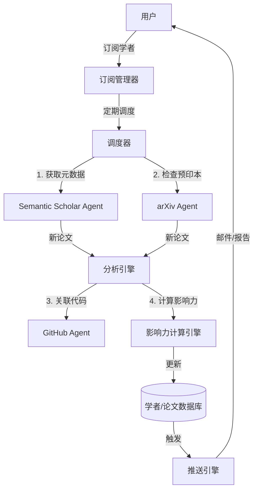

# 学者追踪与影响力分析系统设计方案

## 1. 核心目标
构建一个自动化的学者追踪系统，能够：
1.  **实时监测**：第一时间发现关注学者的新发表论文（预印本或正式发表）。
2.  **多维评估**：不仅看引用量，还结合代码贡献、社交热度等量化影响力。
3.  **智能推送**：生成包含论文摘要、代码链接及影响力解读的简报。

## 2. 数据源调研 (Data Sources)

为了实现全方位的追踪，我们需要整合多源数据：

### 2.1 学术元数据 (核心源)
*   **Semantic Scholar API** (强烈推荐):
    *   **优势**: 免费、覆盖全、提供引用图谱、S2ORC (Open Research Corpus)。
    *   **能力**: 可获取论文列表、引用数、H-index、TL;DR (AI生成的摘要)。
    *   **用途**: 核心数据支撑，用于检测新论文和基础引用数据。
*   **DBLP**:
    *   **优势**: 计算机领域最权威，作者重名消歧做得最好。
    *   **用途**: 验证作者身份，确保不会追踪错人（如同名异人）。
*   **arXiv API**:
    *   **优势**: 最快获取预印本。
    *   **用途**: 捕捉“零日”论文（Zero-day papers），在正式会议发表前获取。

### 2.2 代码与工程影响力
*   **GitHub API**:
    *   **用途**: 关联论文与其代码仓库。
    *   **指标**: Stars, Forks, Issues活跃度, Contributors数量。
*   **PapersWithCode**:
    *   **用途**: 链接论文与代码实现的官方数据源。

### 2.3 社交与舆情 (进阶)
*   **Twitter/X (需API)**: 学术圈讨论热度。
*   **Google Trends**: 关键词搜索热度。
*   **Connected Papers**: 查看论文在引用网络中的中心度。

## 3. 影响力多维量化模型 (Influence Metrics)

我们摒弃单一的 H-index，提出 **"PaperBot Impact Score (PIS)"** 复合指标：

### 3.1 学术影响力 (Academic Impact, $I_a$)
传统指标的加权组合：
*   **H-index**: 长期积累。
*   **i10-index**: 高质量论文数量。
*   **Citation Velocity**: 近3年引用增长率（反映当前活跃度）。
*   **Top Conf Count**: 顶会（CCS/S&P/NDSS/USENIX）发表数量。

### 3.2 工程影响力 (Engineering Impact, $I_e$)
这是 PaperBot 的特色，针对计算机/安全领域：
*   **Code Availability**: 论文是否附带代码 (0/1)。
*   **Repo Stars**: 关联仓库的 Star 总数。
*   **Reproduction Score**: 代码是否易于复现（可通过我们的 CodeAnalysisAgent 评分）。

### 3.3 趋势影响力 (Trend Impact, $I_t$)
*   **Burstiness**: 短期内引用或下载量的爆发程度。
*   **Topic Centrality**: 研究主题是否处于当前热点（如 LLM Security）。

### 🔢 综合评分公式
$$ Score = w_1 \cdot I_a + w_2 \cdot I_e + w_3 \cdot I_t $$
*(例如：安全领域可能更看重工程复现，$w_2$ 权重可调高)*

## 4. 系统架构设计

### 4.1 模块划分



### 4.2 核心组件

1.  **ScholarProfileAgent**:
    *   负责维护学者画像。
    *   定期（如每周）同步 Semantic Scholar 数据。
    *   处理作者消歧（Author Disambiguation）。

2.  **PaperTrackerAgent**:
    *   负责检测新论文。
    *   对比上次扫描的论文列表，找出新增项。
    *   触发 `ResearchAgent` 对新论文进行深度分析（摘要总结、代码提取）。

3.  **InfluenceCalculator**:
    *   实现上述量化公式。
    *   生成可视化图表（如：引用增长曲线、影响力雷达图）。

## 5. 实施路线图

### Phase 1: 基础追踪 (MVP)
*   接入 Semantic Scholar API。
*   实现简单的“新论文检测”。
*   基础邮件通知。

### Phase 2: 影响力分析
*   接入 GitHub API。
*   实现 H-index + Repo Stars 的混合评分。
*   生成学者“能力雷达图”。

### Phase 3: 深度集成
*   与 PaperBot 现有的 `CodeAnalysisAgent` 联动，自动分析新论文的代码质量。
*   基于 BettaFish 的 ReportEngine 生成精美的《学者年度影响力报告》。

## 6. 示例：订阅配置

```yaml
subscriptions:
  scholars:
    - name: "Dawn Song"
      id: "1741101" # Semantic Scholar ID
      keywords: ["Adversarial Machine Learning", "Blockchain"]
    - name: "Nicolas Papernot"
      id: "2810933"
      
  settings:
    check_interval: "daily" # daily, weekly
    min_influence_score: 50 # 过滤低质量论文
    notify_channels: ["email", "slack"]
```
